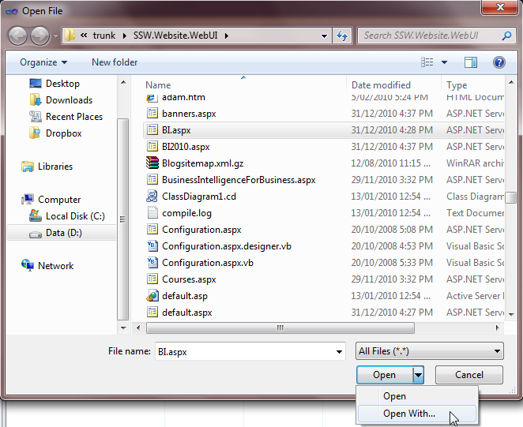
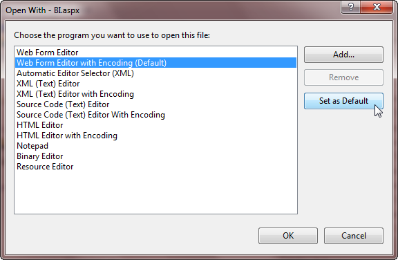
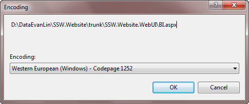
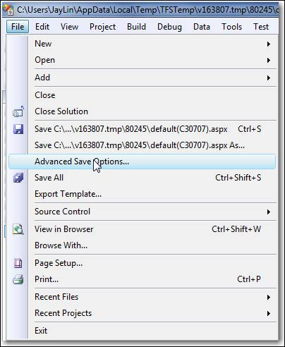
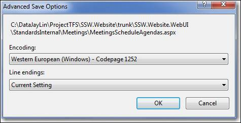

Make sure your Visual Studio encoding is consistent with Sydney to avoid encoding problems in the future.

<!--endintro-->

**Open file with Encoding:**
<dl class="image">&lt;dt&gt;  &lt;/dt&gt;<dd> Figure: Use "Open With...&Figure: Use "Open With..." in Visual Studio to open the file</dd></dl><dl class="image">&lt;dt&gt;  &lt;/dt&gt;<dd> Figure: Set "... Editor with Encoding" as the Default Editor</dd></dl><dl class="image">&lt;dt&gt;  &lt;/dt&gt;<dd> Figure: Make sure your encoding is consistent with Sydney </dd></dl>
**Save file with Encoding:** (Optional - it will be saved w (Optional - it will be saved with opened encoding automatically.)
<dl class="image"> &lt;dt&gt;  &lt;/dt&gt;<dd> Figure: Open "Advance Save Options..." in Visual Studio before checking in</dd></dl><dl class="image">&lt;dt&gt;  &lt;/dt&gt;<dd> Figure: Make sure your setting is consistent with Sydney </dd></dl>
