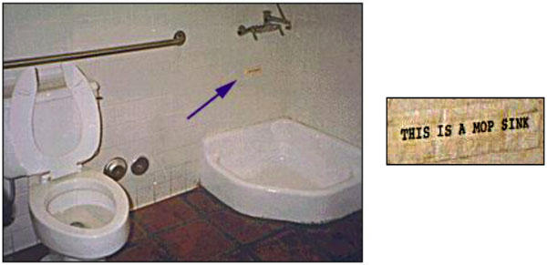
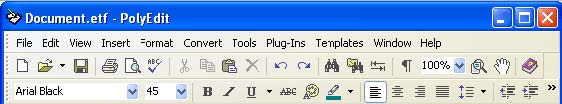
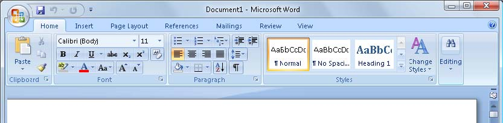

<ol><li>When we see a door, we immediately know that we can open it and go through it</li>
<li>Links in blue and underlined has an affordance of clickability</li>
<li>Buttons can be pressed</li>
<li>Scrollbar moves the document in the window</li></ol>
 <excerpt class='endintro'></excerpt> 
​<dl class="badImage"><dt></dt>
<dd>Figure: Bad Example - The affordance of the checkbox makes this UI misleading</dd></dl>
<dl class="badImage"><dt></dt>
<dd>Figure: Bad Example - If this mop sink didn't look so much like a urinal and wasn't right next to the toilet, maybe the sign wouldn't be necessary.</dd></dl>
<dl class="badImage"><dt></dt>
<dd>Figure: Bad Example – It might not have been a good idea to place a male policeman where the exhaust pipe is.</dd></dl>
<dl class="badImage"><dt></dt>
<dd>Figure: Bad Example - Old MS Word - Because of the UI, people never knew they could use styles e.g. normal, H1, H2</dd></dl>
<dl class="goodImage"><dt></dt>
<dd>Figure: Good Example - New MS Word - Because of the new ribbon UI, people intuitively know how to use styles</dd></dl>

