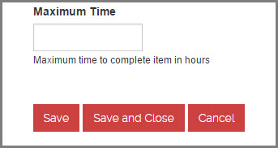
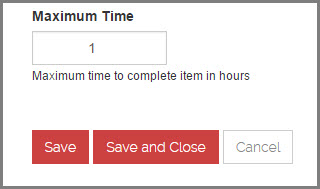

To avoid users accidentally cancelling an operation when they thought they where clicking the save button you should always make your cancel button less obvious.

<!--endintro-->

::: bad  
  
:::

::: good  
  
:::

**Which side should the cancel button be on?**

It depends which operating platform your program runs on:

- Windows - On the right
- Apple, iOS and Android - On the left
- Web - Generally on the right

If you're designing a Web-based application, the decision is harder, but you should probably go with the platform preferred by most of your users. Your server logs will show you the percentage of Windows vs. Mac users for your specific website or intranet. Of course, Windows generally has many more users, so if you can't be bothered to check the logs, then the guideline that will apply to most situations is OK first, Cancel last.

**What do you name your buttons?**

It's often better to name a button to explain what it does, than to use a generic label like "OK". An explicit label serves as "just-in-time help," giving users more confidence in selecting the correct action.

Make the most commonly selected button the default and highlight it. Except if it's action is particularly dangerous; in those cases, you want users to explicitly select the button rather than accidentally activating it by hitting Enter.

**Further Reading:**

- [Nielsen Norman -](http://www.nngroup.com/articles/ok-cancel-or-cancel-ok/) The usability guru talking about ok and cancel buttons
- [SSW Rule - Do you know to use Save, Save and Close on a webpage?](/do-you-know-to-use-save-save-and-close-on-a-webpage)
