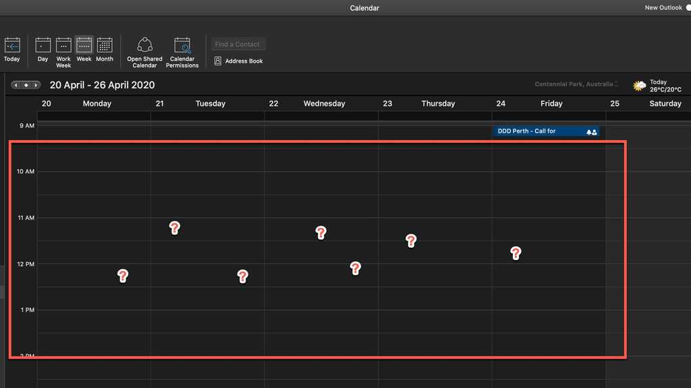

When joining a new team, it's easy to be lost and not know when the important meetings are (like the Daily Scrum, or the next Sprint Review). Broadly, use Teams as the appointment source (rather than Outlook) then the benefit is that you can have a tab where you see it in the context of the team. Then, when a new member joins a Team they do not have to go looking for the appointment, and can easily join the call.

<!--endintro-->

In the past, the best way to do this was to create a SharePoint page with a Group Calendar web part, then add this as a tab in Teams. Microsoft have since released Channel calendars, which are easier to add and nicer to use.

:::bad

:::

:::ok

:::

:::good

:::

### To add a channel calendar

1. Go to the **Team | General channel** (or another channel, if you prefer)
2. Click the + at the top to add a tab
3. Search for "Channel calendar" and click on it
4. Give the tab a name, e.g. SysAdmins Calendar
5. Click Add
6. All done, now all you need to do is setup some meetings for the channel (if you haven't already) - see rule: **[Do you know how to create recurring teams meetings for a channel?](https://www.ssw.com.au/rules/create-recurring-teams-meetings-for-a-channel)**

**Suggestion to Microsoft:** This is an unnecessary extra hoop to jump through. If you create an appointment from a Team, then this tab should be automatically created.

