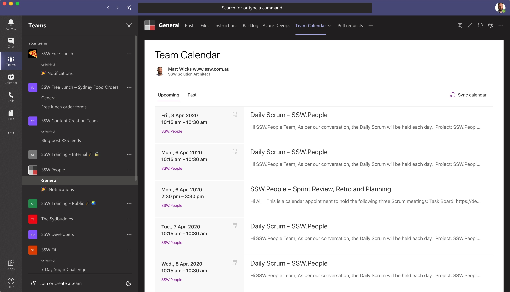
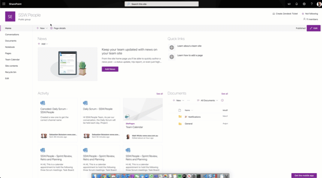
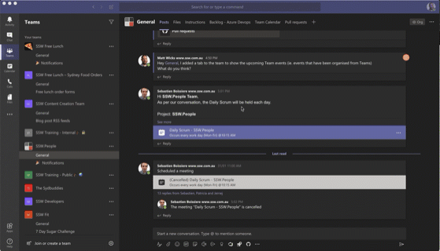
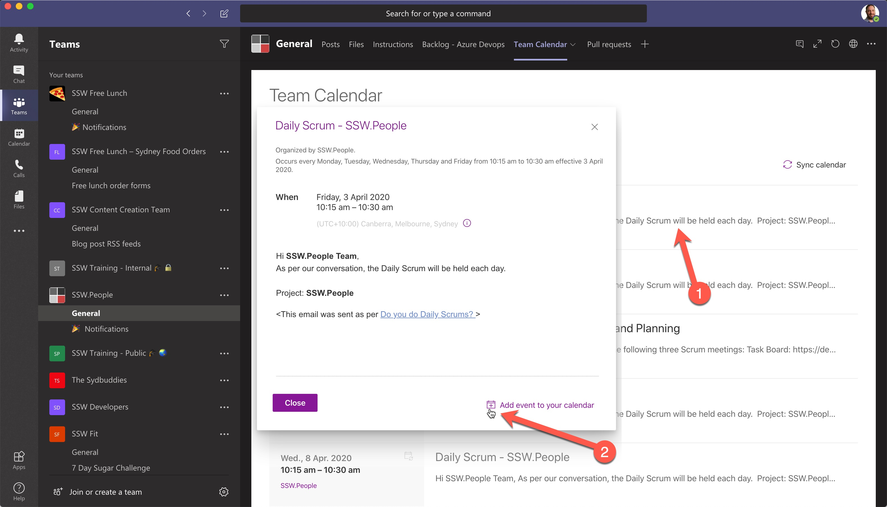

When joining a new team, it's easy to be lost and not know when the important meetings are (like the Daily Scrum, or the next Sprint Review). If you  [run the meetings from Microsoft Teams](/_layouts/15/FIXUPREDIRECT.ASPX?WebId=3dfc0e07-e23a-4cbb-aac2-e778b71166a2&TermSetId=07da3ddf-0924-4cd2-a6d4-a4809ae20160&TermId=91a6a999-29d4-4903-8b7a-16fddd976d65) you can make them easy to find!

<!--endintro-->

::: bad  
  
:::

::: good  
  
:::

1. Open up the Team's SharePoint site (you can find this easily by going to the 
      *Files* tab and clicking 
      *Open in SharePoint*)
2. Go to the SharePoint site's Home page (from the menu on the left)
3. Add a new page
4. Add a Group Calendar web part to the page
5. Publish the page

  

6. In Teams, click add a new SharePoint tab to the Team
7. Select the newly published SharePoint page
8. Click Save

  

9. All done, now all you need to do is setup some meetings for the channel (see rule: )! 😀

**Suggestion to Microsoft:** [This is an unnecessary extra hoop to jump through. If you create an appointment from a Team then this tab should be automatically created.](https://microsoftteams.uservoice.com/forums/555103-public/suggestions/36007027-add-a-team-calendar-to-teams-or-allow-a-project-te)

  

**Warning:** Only the organizer of a meeting can make changes to it and Teams offers no ability to transfer ownership of that meeting.
To be fair you also can’t change meeting owners in Exchange.

Vote for this UserVoice item (that describes that the Teams team is working on delegation for Teams meetings but no ETA).
https://microsoftteams.uservoice.com/forums/555103-public/suggestions/34050022-ms-teams-meeting-delegation
