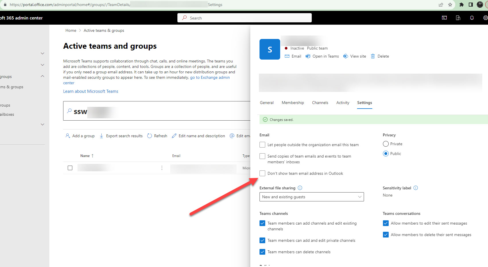
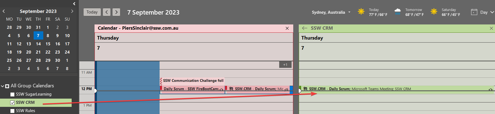

When a developer joins a team, they need to find important meetings like the Daily Scrum and the Sprint Review. Unfortunately, these meetings are often organized by a team member and there is no way to find them.

Ideally, a new team member would jump into Microsoft Teams and find the team they are joining. Then they would see all the important meetings from within the team and join them as needed.

From then on, they would be able to see those appointments in Microsoft Outlook and edit them as needed.

<!--endintro-->

In the past, the best way to do this was to create a SharePoint page with a Group Calendar web part, and then add this as a tab in Teams. Microsoft Teams have since released Channel Calendars, which are better because they are built in.

::: bad

:::

::: ok

:::

::: good

:::

`youtube: MYIjVqD8AUo`
**Video: An awesome introduction to Channel Calendars in Teams (7 min)**

## Setup - Make the calendar visible to the team

Before anyone can view and edit the appointment, it needs to be set up correctly to allow editing.

There are 2 steps:

A. Add a Channel Calendar

B. Make the Channel Calendar visible in Microsoft Outlook

### A. Add a Channel Calendar

1. Go to the **Team | General channel** (or another channel, if you prefer)
2. Click the + at the top to add a tab
3. Search for "Channel Calendar" and click on it
4. Give the tab a name (e.g. SysAdmins Calendar)
5. Click "Add"
6. All done, now the team can see all meetings relating to the team


::: greybox
**Suggestion to Microsoft:** This is an unnecessary extra hoop to jump through. If you create an appointment from a Team, then this tab should be automatically created.
:::

### B. Make the Channel Calendar visible in Microsoft Outlook

Channel Calendar meetings need to be editable by anyone in the Team and the only way to enable that is via a group calendar in Microsoft Outlook.

By default, group calendars do not show up in Microsoft Outlook, so they need to be made visible to the team with a PowerShell command:

::: greybox

```bash
Set-UnifiedGroup -identity {{ GROUP NAME }} -HiddenFromExchangeClientsEnabled:$False
```

**Note:** [This command](https://learn.microsoft.com/en-us/powershell/module/exchange/set-unifiedgroup?view=exchange-ps#-hiddenfromexchangeclientsenabled) will also make the teams' group email address show in the global address list (GAL).

More info: [Removing a Meeting in a Teams Channel when the organizer is gone](https://techcommunity.microsoft.com/t5/microsoft-teams/removing-a-meeting-in-a-teams-channel-when-the-organizer-is-gone/m-p/2106354).

:::

This can also be done from the Microsoft Admin Center:

1. Go to `https://portal.office.com/adminportal`
2. Go to Teams & Groups | Active teams & groups
3. Search for the Teams group | Settings | Uncheck "Don't show team email address in Outlook"




## Manage Appointments - Team members create, join, edit, and leave meetings themselves

Now that the team calendars are properly configured, it is easy to:

A. Create a meeting

B. Join a meeting

C. Edit a meeting

D. Leave a meeting

### A. Create a meeting

Creating a meeting should always be done from Microsoft Teams because Microsoft Outlook doesn't support setting the channel. To create a meeting:

1. Follow the rule on [how to create recurring team meetings for a channel](/create-recurring-teams-meetings-for-a-channel)
2. Add this text at the bottom - This will direct people to this rule when they go to edit it.

::: greybox
\< Need to edit this meeting? See <https://www.ssw.com.au/rules/do-you-make-your-team-meetings-easy-to-find/#c-edit-a-meeting> Team: {{ TEAM NAME }} /\>
:::

### B. Join a meeting

To join a meeting do the following:

1. Navigate to **Microsoft Teams | Team | Channel Calendar**
2. Click on the meeting you want to join and expand it
3. Select "Add to calendar"
4. Done! You are now one of the meeting attendees.


### C. Edit a meeting

To update a meeting, you must change the details from the Microsoft Outlook group calendar:

1. Go to **Microsoft Outlook | Calendars | All Group Calendars**
2. Open the relevant calendar (same as the team name)
3. Open the appointment and select **The entire series**
4. Make changes as needed



### D. Leave a meeting

Many people decline a meeting when they no longer want to attend. However, this method is problematic because you will still be an **Optional** attendee, and receive updates to the appointment.

To leave a meeting properly:

1. Go to **Microsoft Outlook | Calendars | All Group Calendars**
2. Open the relevant calendar (same as the team name)
3. Open the appointment and select **The entire series**
4. Remove yourself as a participant
5. Double-check that no other mailboxes have been added which include you e.g. the Team mailbox

::: bad

:::

::: good

:::
