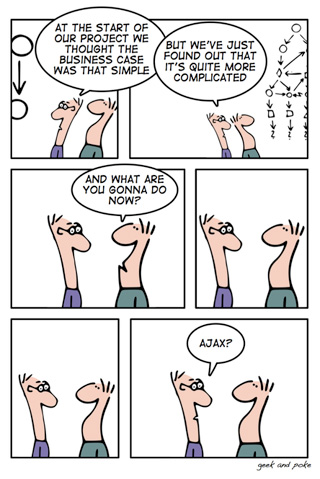

Managing up is providing your manager with an active request or an option to approve, rather than asking a general question.

<!--endintro-->

  

::: greybox
What do you want to charge for David's rate?
:::
::: bad
Figure: Bad example - Nothing to approve
:::

::: greybox
What do you want to charge for David's rate?

I would advise the standard $165 + GST until he has more experience.

1. Please approve
:::
::: good
Figure: Good example - Approval request in form of a task
:::

::: info
**Note:** If it involves technical solution, please provide the steps you are going to follow. 
:::

### Multiple options

When you are giving someone multiple options you should:

* Limit the number of options to 3 to avoid "option overload" (more on [Choice Overload](https://www.behavioraleconomics.com/resources/mini-encyclopedia-of-be/choice-overload/) and [The Burden of Choice](https://www.psychologytoday.com/au/blog/more-tech-support/201011/the-burden-choice))
* Recommend one and state why

::: greybox
We want to integrate our database with our website so that customers can purchase online.

1. Please let me know which option you would like to proceed with, otherwise let me know if you have any questions

 **Option A** <mark>(Recommended)</mark> -  Customize a ready-made solution - We are able to get rid of redundant features and change it to meet our requirements. It is cheaper than building a new solution from scratch.  
 
 **Option B** - Buy a ready-made solution - The ready-made solution is cheap but it does not have everything that we need and has unnecessary features.
 
 **Option C** - Build a new solution using a third party company - It will be expensive and it will take a long time.

:::
::: good
Figure: Good example - Multiple options with reasons and a recommendation
:::

::: info
**Note:** When presenting choices, it is important to avoid using the term "version" as it pertains to specific iterations or editions. Always use "options" which refer to selectable variations or customizable features.
:::

