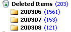
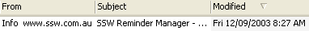

Your deleted items can become quite out of hand if you don't manage them. First, it can waste a lot of space on your hard drive, and second, after accidentally deleting a mail item, it can take days to find it again amongst the 30,000 messages in your Deleted Items Folder. 

<!--endintro-->

Here's a couple of solutions:

* Permanently delete your deleted items. This is based on the theory that once you have deleted a mail item, you should NEVER HAVE TO LOOK AT IT AGAIN. This is a good theory, but unfortunately, we don't always follow it in practice and there's no recovery
* Move the items into subfolders under Deleted Items. This is a good solution as you can manually archive items, making it easier to search. You can permanently delete items when they reach a certain age.

<dl class="goodImage">&lt;dt&gt;&lt;/dt&gt;<dd>Figure: Good Example - Deleted Items ordered into time periods</dd></dl>
**Note:** A hot tip for making it easy to search for an accidentally deleted item is to add the "Modified" field into your Deleted Items view and sort by "Modified". The item from two months ago which you just accidentally deleted will be sitting at the top.

<dl class="image">   &lt;dt&gt;&lt;/dt&gt;<dd>Figure: Sort by "Modified"</dd></dl>
