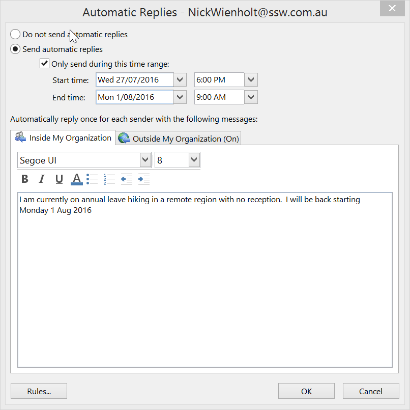

When you are on leave, you need to make sure that your mailbox is monitored. The best way to do this is by either:  

<!--endintro-->

* For extended periods off the grid, asking someone (nicely) to check your mailbox if you are away for 3 days or more. This ensures that any important emails from clients are actioned,
* Make sure all client emails are handled before you leave; either delegate the task, or inform the person taking care of your inbox or,
* Check it yourself every 3-4 days from home or wherever you are (a Hawaiian beach or Himalayan mountain maybe!).  People are generally okay waiting a couple of days for a reply.  **For extended periods off the grid, the use of Out of Office is good** , but when you expect to have partial connectivity and anticipate replying, don't set your Out of Office on at all.

The use of 'Out of Office - Automated Response' emails should be avoided unless you plan to be away for more than a week, and unable to check your emails while away. In this case, it is also good to mention one or two alternative contact(s).
