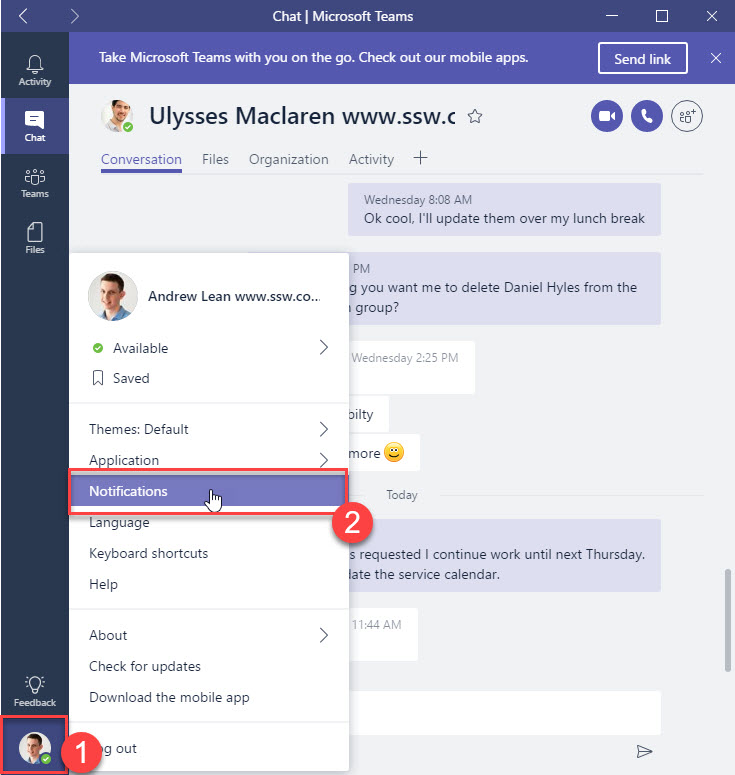
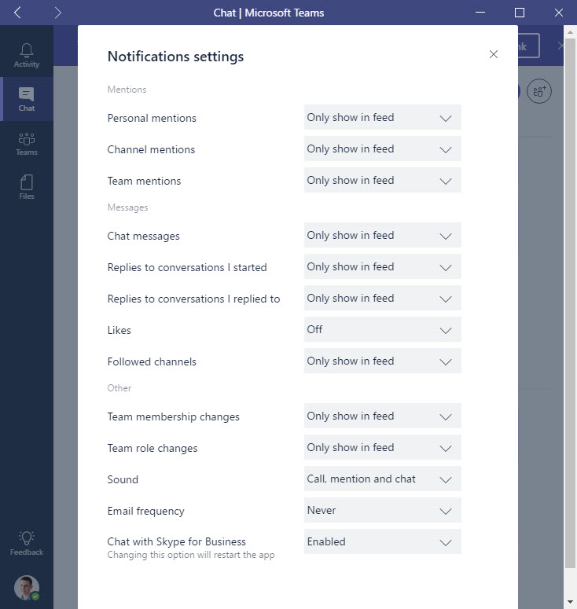
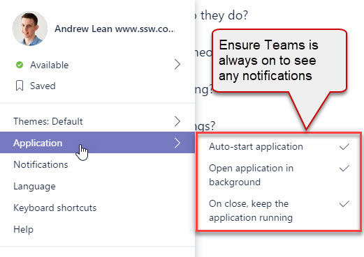

​​​<a href="/_layouts/15/FIXUPREDIRECT.ASPX?WebId=3dfc0e07-e23a-4cbb-aac2-e778b71166a2&TermSetId=07da3ddf-0924-4cd2-a6d4-a4809ae20160&TermId=d65f17a0-2354-4793-9481-7dc2eea0e559">Dealing with distractions</a> is a fundamental rule to a successful project. Microsoft Teams is a great way to get distracted. Following these options helps you to minimize message distractions: <ol><li>Turn on at start-up​ - With the application always on your desktop, there is no reason for alerts to be sent to your email or phone </li><li>Disable email alerts - this <a href="/_layouts/15/FIXUPREDIRECT.ASPX?WebId=3dfc0e07-e23a-4cbb-aac2-e778b71166a2&TermSetId=07da3ddf-0924-4cd2-a6d4-a4809ae20160&TermId=4ebaa676-4599-4be1-b4ee-55427dba91bf">reduces bloat in your task list</a> </li></ol>
 <excerpt class='endintro'></excerpt> 
<dl class="image"><dt></dt><dd>Figure: Open options (select image in the bottom right) | Notifications</dd></dl><dl class="image"><dt> </dt><dd> Figure: Set settings to "Only show in feed" so distracting phone and email alerts aren't sent</dd></dl><dl class="image"><dt></dt><dd> Figure: In Microsoft Teams turn on "Auto-start application". Suggestion to Microsoft: Make this the default </dd></dl><h3 class="ssw15-rteElement-H3">Related Rules ​ </h3><ul class="ssw15-rteElement-P"><li>If you run Outlook to manage the email you should also <a href=/do-you-minimize-your-outlook-distractions>minimize Outlook distractions​</a>.​</li><li>If you use Skype too​ you should also <a href=/minimize-skype-distractions>minimize Skype distractions</a>.​​</li></ul>

