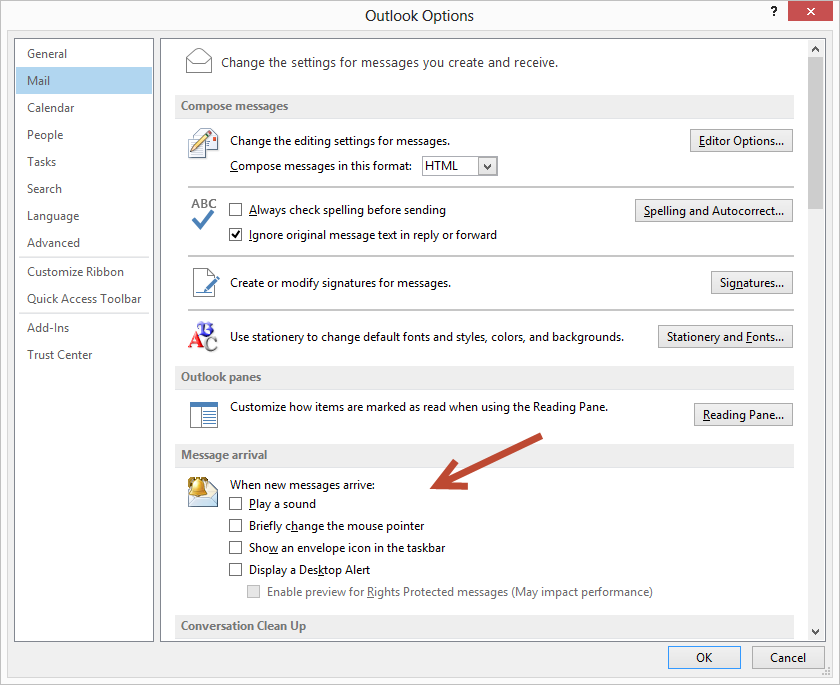

Getting in the zone is pretty challenging in any work environment. Outlook in particular likes to offer as many distractions as possible to ensure you can never forget you've got it open. Set your options so that Outlook: 
 
 <excerpt class='endintro'></excerpt> 
<dl class="goodImage"><dt>
      
   </dt><dd>Figure: Good Example - Turn off Outlook distractions on Windows​ </dd></dl><dl class="goodImage"><dt>
      
   </dt><dd>Figure: Good Example - Turn off Outlook distractions on a Mac </dd></dl><ul><li>Doesn't play a sound</li><li>Doesn't briefly change the mouse cursor</li><li>Doesn't show an envelope</li><li>and DOESN'T display a New Mail Desktop Alert</li></ul>
Here are a few more distractions tips:
<ul><li>
      <a href="/_layouts/15/FIXUPREDIRECT.ASPX?WebId=3dfc0e07-e23a-4cbb-aac2-e778b71166a2&TermSetId=07da3ddf-0924-4cd2-a6d4-a4809ae20160&TermId=ab17d85c-5ee1-44a9-8433-200bd5771337">Minimize Teams distractions​</a> </li><li> 
      <a href="/_layouts/15/FIXUPREDIRECT.ASPX?WebId=3dfc0e07-e23a-4cbb-aac2-e778b71166a2&TermSetId=07da3ddf-0924-4cd2-a6d4-a4809ae20160&TermId=6650d51f-dc2c-47d4-a779-2dc4f8a3c8c9" shape="rect">Minimize Skype distractions</a> </li><li>
      <a href="/_layouts/15/FIXUPREDIRECT.ASPX?WebId=3dfc0e07-e23a-4cbb-aac2-e778b71166a2&TermSetId=07da3ddf-0924-4cd2-a6d4-a4809ae20160&TermId=d65f17a0-2354-4793-9481-7dc2eea0e559" shape="rect">General working environment distractions</a>​ </li><li>
      <a href="https://support.google.com/mail/answer/1075549">Turn off email notifications on Gmail</a> </li></ul> 
 

