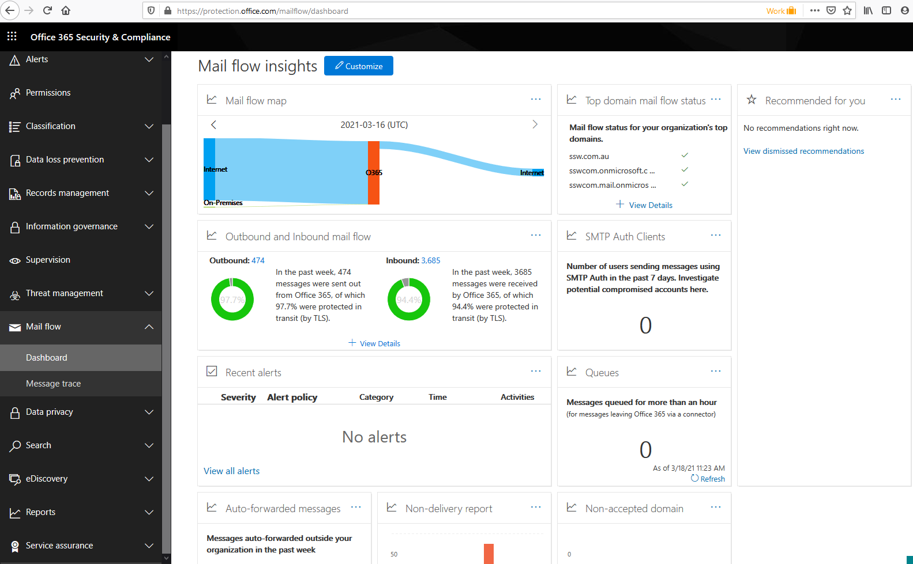

If email is the property of the employer, then it makes sense to monitor the health of your emails and email server.

<!--endintro-->

If you are using Exchange Online as your mail server, you can see a whole dashboard of your current email situation at [Office 365 Security & Compliance](https://protection.office.com/mailflow/dashboard), including:

1. **Mail Flow Map** - Where are your emails coming from and going to
2. **Outbound and inbound email count**
3. **Alerts** - Is anything wrong happening with my emails?
4. **Queues** - Are any emails pending on a queue (not being delivered)?

::: good

:::

Always keep on top of your email health!
