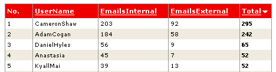

Following from the previous rule, if email is actually the property of the employer, then it makes sense to actually track who is sending emails to whom. 

<!--endintro-->

Using the Microsoft Exchange Web Storage System, you should track the number of emails sent internally (i.e. to a colleague) and emails sent to clients in your corporate database.

One option is to use a [Utility for Exchange Reports](http://www.ssw.com.au/ssw/ExchangeReporter/) called SSW Exchange Reporter.

Note that although it is acceptable for seniors to check juniors' email, it is not acceptable for juniors to check seniors' email.
