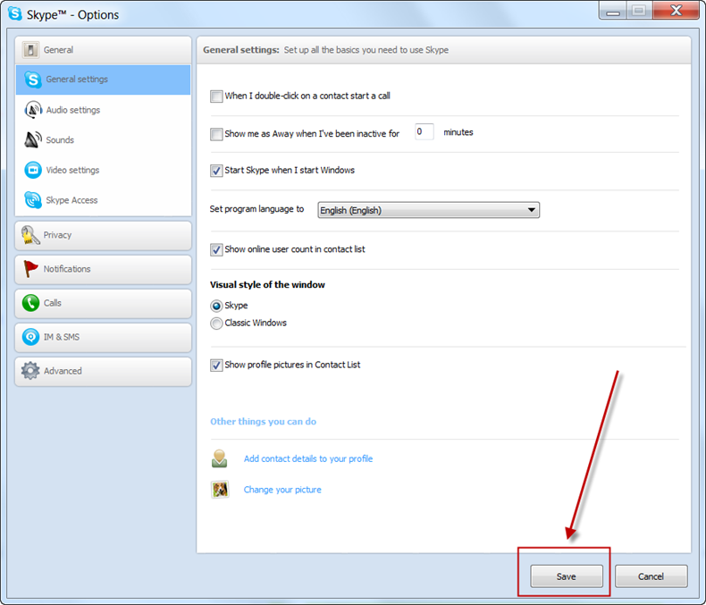
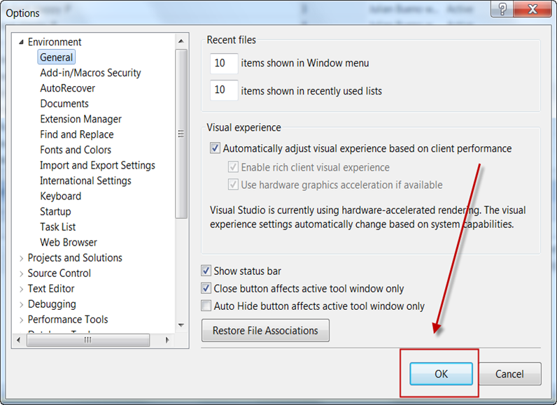

If your form has an "Ok" button it should be renamed to be an Action. For Example: Save, Open etc.  

<!--endintro-->

::: good

:::

::: bad

:::

We have a program called [SSW Code Auditor](https://ssw.com.au/ssw/CodeAuditor/Rules.aspx#OkButtonsAction) to check for this rule.
