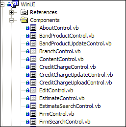

In every Windows application project, we need to have a main, start-up or wizard page  form for a better structure and design.  
<!--endintro-->
 Bad example - The entry form is not immediately recognizable because of a non standard name  Good example - The entry form follows the naming convention rule 

| We have a program called [SSW Code Auditor](http://www.ssw.com.au/ssw/CodeAuditor/Default.aspx#VBMainForm) to check for this rule.
            
Note: In Code Auditor we check for Form named: Startup, MainForm and WizardPage. |
| --- |
