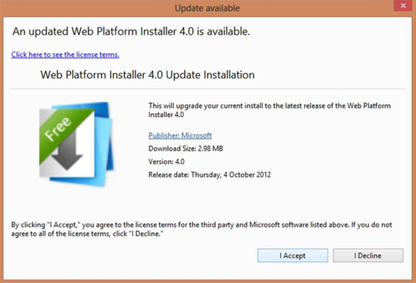
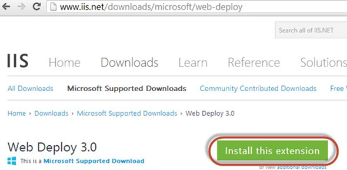

You should not Install Web Deploy from the Web Platform Installer, but instead download the installation from the IIS website (http://www.iis.net/downloads/microsoft/web-deploy).

The reason for this is that the Web Platform Installer does not install all of the components required for continuous deployment, but the downloaded package does.

<!--endintro-->

More information on this issue here: [Don't Install Web Deployment Tool using the Web Platform Installer](http://nicksnettravels.builttoroam.com/post/2010/04/22/Done28099t-Install-Web-Deployment-Tool-using-the-Web-Platform-Installer.aspx)

::: bad  
  
:::

::: good  
  
:::
