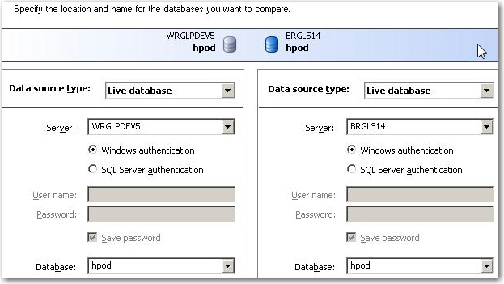
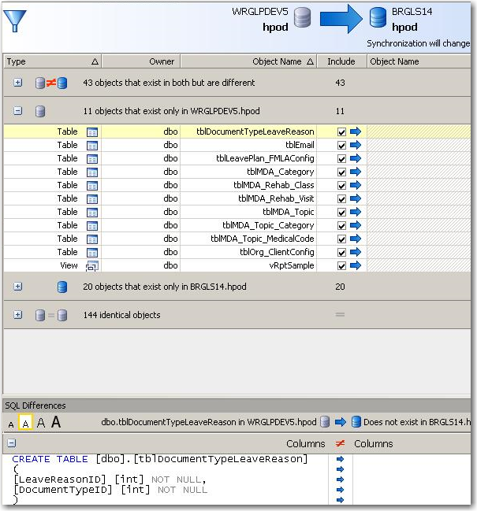

SQL Compare is a good tool to find out the differences between two databases. It can help you answer the question "Is your database the same as mine?". 

 Let's see what it is good at.   
<!--endintro-->
<dl class="image">    &lt;dt&gt; &lt;/dt&gt;
    <dd>Figure: You can use SQL Compare to make two databases the same </dd></dl><dl class="image">    &lt;dt&gt; &lt;/dt&gt;
    <dd>Figure: SQL Compare clearly shows some tables are missing </dd></dl>
So if you want to compare 2 databases SQL Compare (or Data Dudes Compare) is great tools. They even let you synchronize sweetly between these 2 databases. However, if you are doing this at the end of your release cycle, you have a problem.  Your schema deployment process is broken.

What you should be doing is seeing your [Schema Master](/Pages/DoYouHaveASchemaMaster.aspx "Database Schema Master") each time you have a new .sql file. You do this during the development process, not at the end in the package and deployment process.
<dl class="image">    &lt;dt&gt; &lt;/dt&gt;
    <dd>Figure: Give your SQL scripts to 'Schema Master' who will, check them into TFS, then run them </dd></dl>Note: We have a tool called <a shape="rect" href="http://www.ssw.com.au/ssw/SQLDeploy/">SQL Deploy</a> to help with automatic deployment.
