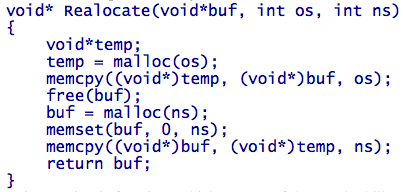
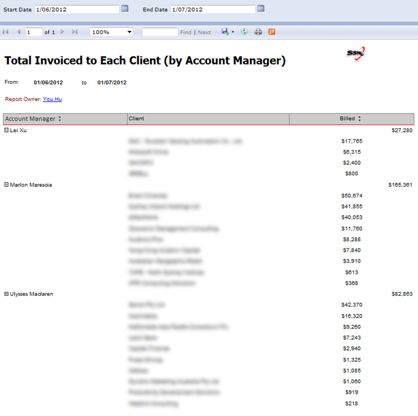

You won the job with a great [1st Date (aka Spec Review)](/do-you-ensure-an-excellent-1st-date-aka-winning-customers-via-a-smaller-specification-review), but no marriage can last without ongoing effort.

<!--endintro-->

Left to their own devices, most developers will slowly make more and more unmaintainable code, that is only comprehendable by themselves. This isn't a big problem for them as they are in it every day and know how it all fits together, but if they're not coding to a set of industry standards, you'll find this code very hard for anyone else to maintain.

::: bad  
  
:::

This can be fixed by having regular software audits with a Solution Architect to keep the developers accountable.

Each month, the Account Managers call all their current clients that have had a substantial amount of work done and offer them a [Software Review](/do-you-conduct-an-architecture-review-after-every-sprint).

This makes more maintainable software with better architecture using industry standards.

**More information: The process:**

1. In the pre-sales, you should have already explained the concept of Software Reviews.
2. Look at a report to show your main current clients (best seen by who was invoiced in the past month)
   - Tip: This is also a good thing to have up on the wall as a reminder of who your main customers are at the moment.

3. Choose your top clients based on who's had a substantial amount of work done (e.g. Say 10k in the last month)

4. Call them. Ask them how their project is going and if they have any concerns or anything they’d like changed
   - Prepare by making sure you've read the latest [Review/Retro email](/sprint-review-retro-email)
5. Offer them a Software Review with one of your top consultants.
   This will ensure that best practices are being followed for all your major projects and help to ensure the quality of
   the solutions developed
