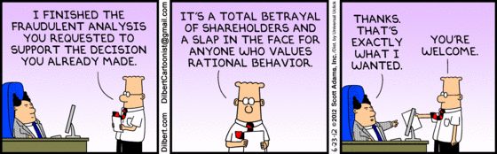

If someone asks you to do something you believe is unethical, please ring them up straight away and discuss the issue.

<!--endintro-->

It can also be a good idea to [document your objections in an email](/do-you-send-a-for-the-record-email-when-you-disagree).
