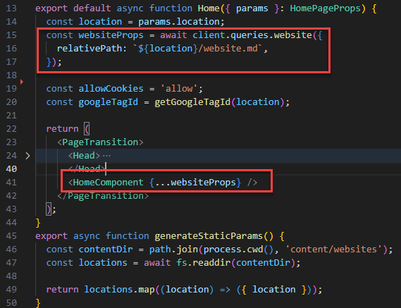

Structuring and optimizing your TinaCMS project is essential to achieve clarity, enhance performance, and prevent build failures. Poorly optimized projects can lead to slow site performance, increased server load, and even failed builds due to excessive or inefficient data requests.

Let’s explore how to structure your project effectively and apply best practices to boost performance both in runtime and during the build process.

<!--endintro-->

## 1. Structuring your TinaCMS Architecture

When working with large datasets or generating multiple subcomponents, following best practices is crucial to maintain performance and clarity.

### ❌ Bad practices

* **Making individual requests with Tina client for each Subcomponent**

  * This method can overwhelm the build process, particularly when dealing with a large number of subcomponents.
* **Using deeply nested schemas with nested references**

  * Complex and deeply nested schemas increase the complexity of the project, making it harder to manage and more prone to build failures.
  * They can also lead to inefficient data fetching, further slowing down both runtime and build processes.

### ✅ Good practices

* **Making a single request at a top-level server component and passing props down**

  * Data fetched at the top level is cached by default, which enhances performance by reducing redundant API calls.
  * Subcomponents can directly access the necessary data, eliminating the need for repeated requests.

::: good

:::

* **Caching data at a Top-level and accessing it when necessary**

  * If passing props is not feasible (e.g., when a component depends on Next.js router information), you should make a general top-level request, cache the data, and then access it directly from the cache within the component.
  * This approach ensures efficient data retrieval and reduces the server load at build time.

## 2. Improving Runtime Performance

Optimizing runtime performance is key to delivering a fast and responsive user experience.

### ❌ Bad practices

* **Using client-side requests instead of cached values from server-side components**

  * This approach bypasses pre-fetched, cached data, increasing server load and slowing down the application.
  * It negates the benefits of static site generation, where data should be ready and waiting.

### Common practices

* **Utilizing Next.js caching via fetch** 

  * Next.js’s fetch API is designed to cache by default during static generation and server-side rendering.

### ✅ Good practices

* **Utilizing caching at the highest level of the application**

  * By caching data at the top level, you ensure that it is readily available throughout your application, reducing redundant data fetching and improving overall performance.
  * This approach allows for more efficient data management and quicker response times.
* **Using dedicated caching packages**

  * [**Redis**:](https://redis.io/fr/solutions/cas-dutilisation/cache/) An in-memory data structure store, Redis is fast and versatile, making it ideal for caching data in memory. 
  * [**Node-cache**:](https://www.npmjs.com/package/node-cache) A lightweight, in-memory caching solution for Node.js applications.

## 3. Preventing Build Crashes

To ensure smooth and reliable builds, it’s important to follow best practices that prevent excessive server load and manage data efficiently.

### ✅ Best practices

* **Avoid isolating Tina client calls in multiple subcomponents**

  * Centralize data fetching to avoid overwhelming the build process with excessive API requests.

     E.g. If your application has a footer and a header that fetch data every time you navigate to a new page, you can improve performance by caching this data from a top-level call.

* **Cache large datasets at a top level**

  * By caching large datasets at a top level, you reduce the number of data fetches during the build process, lowering the risk of overwhelming the system.

    E.g. If your application has a list of recipes that fetch data each time you view a recipe, caching all the data at the top level instead of fetching it each time would reduce API calls during the build process.

* **Avoid using deeply nested references**

  * Simplifying your data structure and avoiding deeply nested references can help ensure smoother and faster builds.

* **Write custom Tina queries**

  * You can improve build generation and prevent build crash by creating your own Tina GraphQL queries.  

    Some of the auto-generated Tina queries are not optimized, such as those with nested objects containing redundant data. For example, recipes that include an ingredients object, which in turn includes the same recipes again. Creating custom queries can reduce the size of objects and improve performance.
