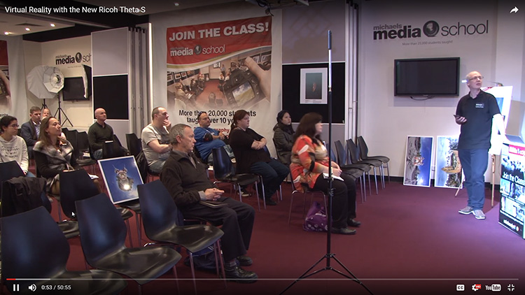
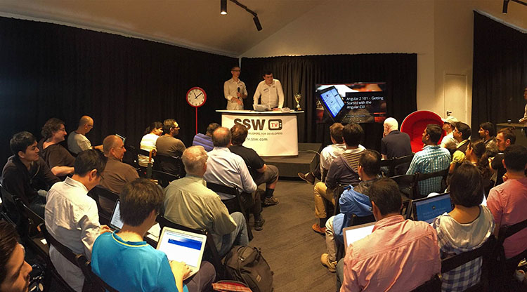
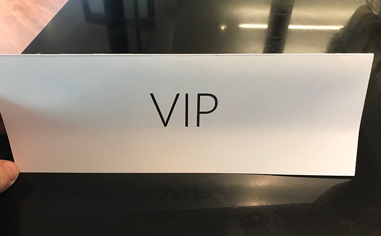

Audience shots are great except when you don’t have a full house. In this case you should move people to be next to each other.

<!--endintro-->
<dl class="badImage"> 
   &lt;dt&gt;&lt;/dt&gt;<dd>Figure: Bad example – the audience shot shows the bad numbers. It would be better to not use this view</dd></dl><dl class="badImage"> 
   &lt;dt&gt;&lt;/dt&gt;<dd>Figure: Bad example – the audience shot shows the bad numbers. You want to use this wide shot, but you need to make sure the attendees not in the shot are moved so their head is visible</dd></dl><dl class="goodImage"> 
   &lt;dt&gt;
      
   &lt;/dt&gt;<dd>Figure: Good example – a shot from the 
      <a href="https://www.ssw.com.au/ssw/events/venues/hire-conference-room.aspx" target="_blank">SSW Chapel</a> where the audience has been moved so they are in shot</dd></dl>**TIP:** To ensure you get the best shot possible, fill seating from the front back. It's a good idea to use VIP signs and place them on the back row to prevent people sitting there initially. These can be moved later when all seats are filled at the front. 

<dl class="image">&lt;dt&gt;&lt;/dt&gt;<dd>Figure: Using a VIP sign on the back row to prevent people sitting there initially </dd></dl>
