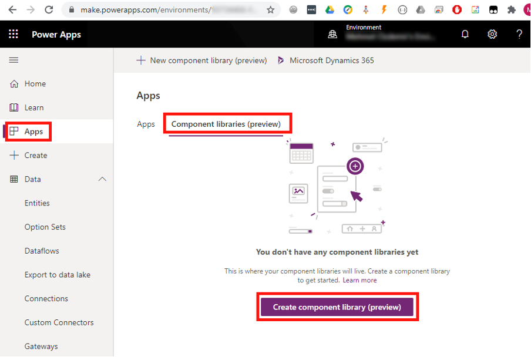

If you are creating and using Components, you’re already doing a great job. The next step is to move those commonly used components into a Component Library. The advantage of moving to a Component Library is the Components will be accessible by all your apps. Another advantage is Components can be shared with other makers to use in their apps. To create a Component library, go to:

**Apps | Component libraries | Create Component library**

<!--endintro-->
<dl class="image">&lt;dt&gt;&lt;/dt&gt;<dd>Figure: Create a new component library</dd></dl>
For more information on Component libraries see documentation here:     https://docs.microsoft.com/en-us/powerapps/maker/canvas-apps/component-library
