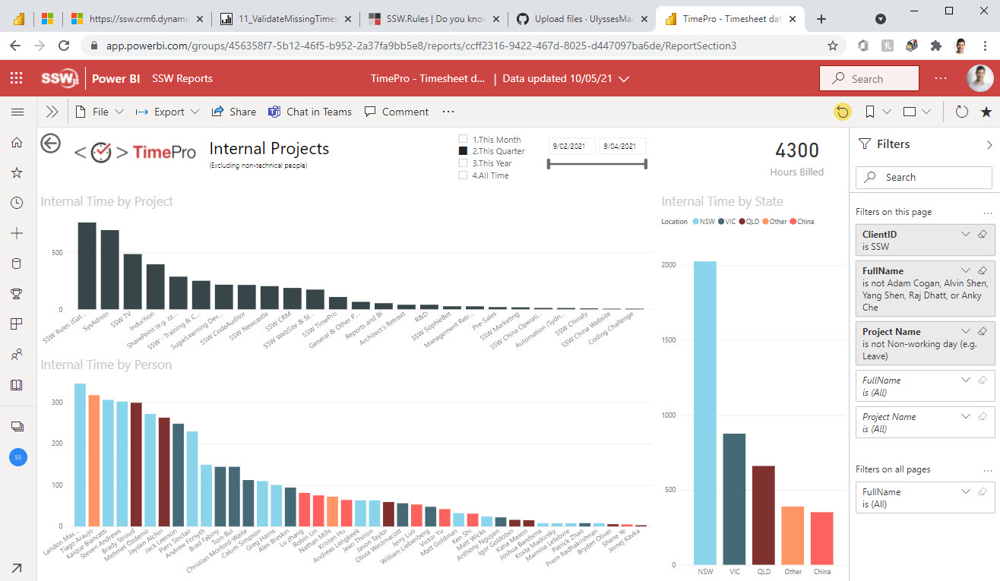

It's tempting when you create a Power BI report to put slicers wherever they fit, but this can lead to an incosistent experience for users.

<!--endintro-->

A better solution is to always put your slicers at the top (and towards the right) whenever possible, and also to replace any non-essential slicers with filters instead, as the filter pane fully collapses on the right hand side, and the control to expand it is already at the top right hand corner of the screen.

::: good

:::
