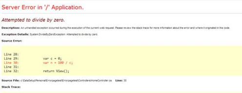
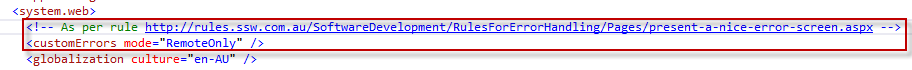

​​​Your users should never see the “yellow screen of death” in ASP.NET. Errors should be caught, logged and a user-friendly screen displayed to the user.

 <excerpt class='endintro'></excerpt> 

This last part is done by specifying the customErrors element in the web.config file.

This will activate ASP.NET’s built in error page (e.g. MVC’s HandleErrorAttribute filter) which can then be customized to suit your application.

 
<blockquote style="margin:0px 0px 0px 40px;border:none;padding:0px;">​

</blockquote><dl class="badImage"><dd>Figure: Bad Example – Yellow Screen of Death</dd></dl><dl class="goodImage"><dt></dt><dd>Figure: Good Example - Default ASP.NET MVC custom error page</dd>
​ 

​However, as a developer you still want to be able to view the detail of the exception in your local development environment. Use the below setting in your Web Application's web.config file to view the yellow screen locally but present a nice error screen to the user. 

​​​​
<dd class="ssw15-rteElement-FigureGood">​​​Figure: Good Example - Don't hide the yellow screen of death in the local environment</dd>
 
</dl>

