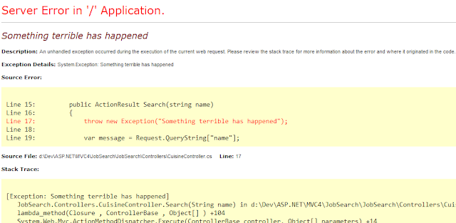
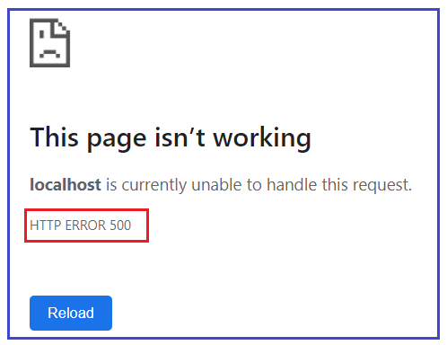
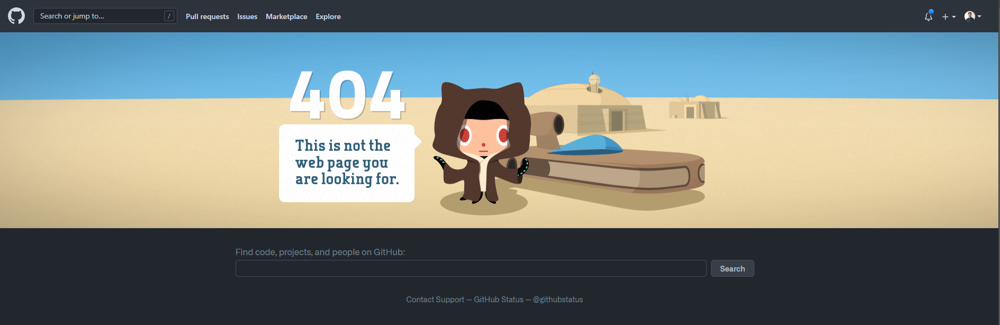
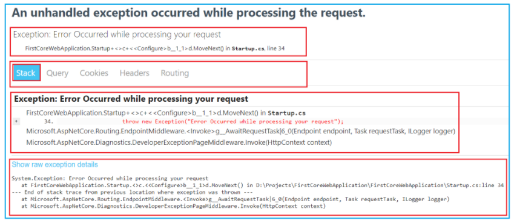

Your users should never see the “yellow screen of death”. Errors should be caught, logged and a user-friendly screen displayed to the user.

<!--endintro-->

::: bad

:::

::: bad 

:::

::: good  

:::

However, as a developer you still want to be able to view the detail of the exception in your local development environment. 

## How-to set up development environment exception pages in ASP.NET Core

To set up exceptions in your local development environment you need to configure the Developer Exception Page middleware in the request processing pipeline.
Unless you have modified the default template, it should work out of the box. Here are the important lines:

```
public void Configure(IApplicationBuilder app, IWebHostEnvironment env)
{
    if (env.IsDevelopment())
    {
        app.UseDeveloperExceptionPage();
    }
    else
    {
        app.UseExceptionHandler("/Error");
        app.UseHsts();
    }
    ...
}
```

::: good  

:::

Find out more about exception handling in .NET Core 5 [here](https://docs.microsoft.com/en-us/aspnet/core/fundamentals/error-handling?view=aspnetcore-5.0).
