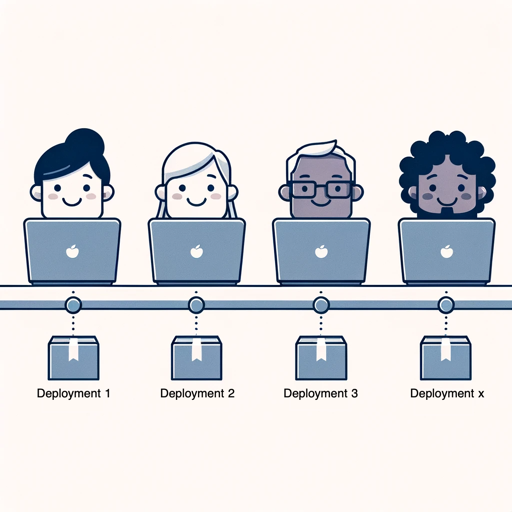

Imagine managing a bunch of projects, each with its own goals and deadlines. It's easy to get caught up in the details and miss the bigger picture. Sometimes, even though every project seems super important, they might not all line up with what the business really needs. That's when you realize: it's all about focusing on value streams, not just individual projects.

<!--endintro-->

## What Are Value Streams?

Think of value streams like a roadmap. They're the steps an organization takes to whip up solutions that keep the good stuff – value – constantly flowing to customers. Instead of just diving into projects headfirst, focusing on value streams ensures everything we do is all about delivering the best bang for the buck for both customers and the business.

### Benefits of Prioritizing Value Streams

**Alignment with Business Goals**

When you focus on value streams, you're basically making sure everything you do lines up with the big goals of the business. Instead of getting lost in the weeds of random tasks, you're always on track with what really matters for the company.

**Efficiency**

When you zero in on value streams, it's like decluttering your workspace. You toss out the unnecessary stuff and make everything run smoother. No more wasted effort—just a streamlined flow of work that makes sense.

**Customer-Centric**

It's like giving your customers exactly what they've been craving for. With this approach, you're not just checking boxes; you're delivering stuff that really makes a difference to the people who matter most – the customers.

::: greybox
Align your work with value streams to ensure maximum business and customer value.
:::

::: good

:::

## Why Should You Prioritize Value Streams?

### Greater Business Agility

Think of it this way: choosing value streams over just projects is like having a nimble dance step. You can quickly pivot and change direction, making your business groove smoothly with whatever tune the market's playing.

::: greybox
Adopt a value stream focus for greater agility.
:::

::: good

:::

### Improved ROI

By centering your efforts on true value, you're essentially optimizing where resources are directed. This focus ensures that every ounce of effort and investment aligns with the highest value outcomes. 

The result? A more robust return on investment (ROI), as you're systematically aligning work with what delivers the greatest value.

::: greybox
Focus on value streams for better ROI.
:::

::: bad

:::

## Conclusion

Choosing to prioritize value streams above isolated projects isn't just a change in process—it's a strategic move. This approach not only aligns your efforts with overarching business objectives but also bolsters efficiency and guarantees genuine value delivery to customers. 

Embracing this perspective could be the game-changer your business needs for improved outcomes.
