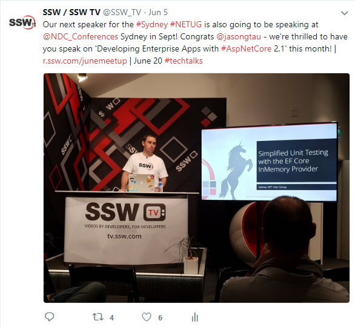

Do you need to increase the attendance at your User Groups?

A great way to increase your over all audience, as well as your attendance at each User Group, is to use social media and online forums like MeetUp to advertise your events. At SSW we use MeetUp, as well as the social media platforms, Twitter, Facebook, Instagram and LinkedIn to announce all of our upcoming User Groups and keep track of attendance.

<!--endintro-->

For tips on taking great photos for social media promotions, see [Do you know how to take great photos for your socials?](/know-how-to-take-great-photos-for-your-socials)

You can read more about promoting your events here in our [Rules to Better Social Media](/rules-to-better-social-media) and in [Promotion - Do People Know About Your Event.](/promotion-do-people-know-about-your-event)
