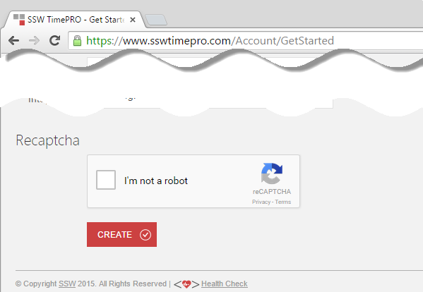
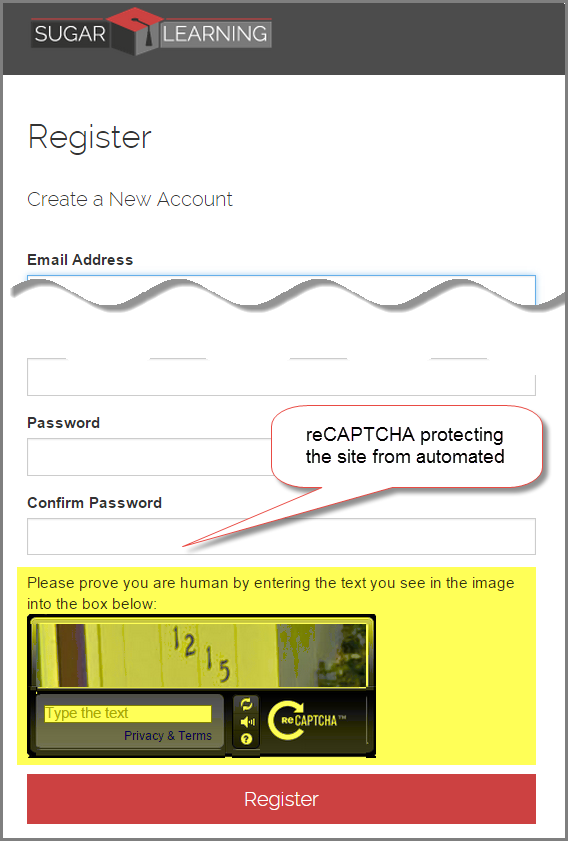
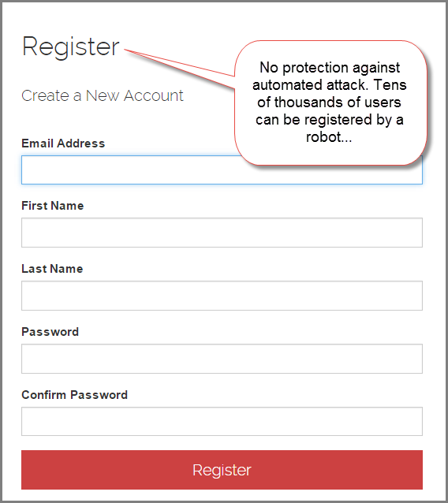

Protecting your site from automated attack is easy with reCAPTCHA.

<!--endintro-->

Learn how to by clicking [this link](https://shigemimatsumoto.wordpress.com/2015/04/27/protecting-mvc-web-application-with-recaptcha-22/) and improve your site security.

::: good
Figure: Good Example - reCAPTCHA is protecting a site from automated attack  
:::

::: bad
Figure: Bad Example - Older v1 reCAPTCHA.

:::

::: bad
Figure: Bad Example - No protection, a robot can register tens or thousands of users...  
:::
