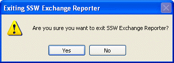

​A product should not close without providing a warning. We use the following message box to warn the user before closing a program:

 <excerpt class='endintro'></excerpt> 
​<dl class="goodImage"><dt></dt>
<dd>Figure: Good Example - Standard warning before a program exits</dd></dl>
<dl class="code"><dt><pre>        private void OnExit(object sender) 
             { 
                EventHandler handler = ExitRequest; 
                if (handler!= null ) 
                { 
                   handler(sender, EventArgs.Empty);
                   return;
                } 
                string closeTitle = string.Format("Exiting{0}", Application.ProductName);
                string closeMessage = string.Format("Are you sure you want to exit {0}", Application.ProductName);
                DialogResult result = MessageBox.Show(closeMessage,closeTitle, MessageBoxButtons.YesNo,MessageBoxIcon.Warning);
                if (result == DialogResult.Yes)
                { 
                   Application.Exit();
                } 
             }
                        </pre></dt></dl>

We have an example of this in the <a href="http://www.ssw.com.au/ssw/NETToolkit/">SSW .NET Toolkit</a>.

