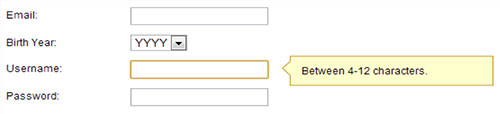

If you have form fields that require some further information, you can provide a hints column next to the fields so users know what the purpose of the data is.

<!--endintro-->
<dl class="goodImage">&lt;dt&gt; 
      
   &lt;/dt&gt;<dd> Figure: Good example - Field hints can make the user more comfortable</dd></dl>
