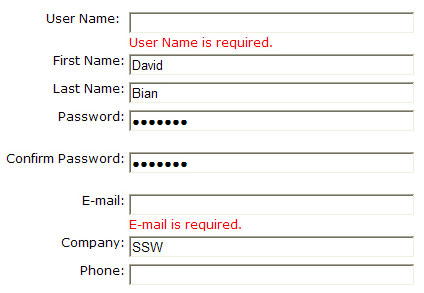

Too often error messages are a summary at the top or the bottom of the page. Instead please provide an error message per validation error, next to the field (and in red!).​
 <excerpt class='endintro'></excerpt> 
<dl class="goodImage"><dt></dt><dd>Figure: Good example - ​Provide red errors next to the field</dd></dl>

