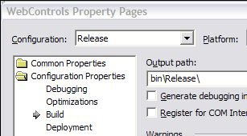
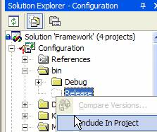

Incrementally as we do more and more .NET projects, we discover that we are re-doing a lot of things we've done in other projects. How do I get a value from the config file? How do I write it back? How do I handle all my uncaught exceptions globally and what do I do with them?

<!--endintro-->

Corresponding with Microsoft's release of their application blocks, we've also started to build components and share them across projects.

Sharing a binary file with SourceSafe isn't a breeze to do, and here are the steps you need to take. It can be a bit daunting at first.

As the component developer, there are four steps:

1. In Visual Studio.NET, Switch to release build
 Figure: Switch to release configuration
2. In your project properties, make sure the release configuration goes to the bin\Release? folder. While you are here, also make sure XML docs are generated. Use the same name as your dll but change the extension to .xml (eg. for SSW.Framework.Configuration.dll -&gt; add SSW.Framework.Configuration.xml)
 Figure: Project properties    Note: The following examples are considered being used for C#. Visual Basic, by default, does not have \bin\Release and \bin\Debug which means that the debug and release builds will overwrite each other unless the default settings are changed to match C# (recommended). VB does not support XML comments either, please wait for the next release of Visual Studio (Whidbey).
 Figure: Force change to match C#
3. If this is the first time, include/check-in the release directory into your SourceSafe
 Figure: Include the bin\Release directory into source safe
4. Make sure everythings checked-in properly. When you build new versions, switch to Release?mode and checkout the release dlls, overwrite them, and when you check them back in they will be the new dll shared by other applications.
5. If the component is part of a set of components, located in a solution, with some dependency between them. You need to check out ALL the bin\Release folders for all projects in that solution and do a build. Then check in all of them. This will ensure dependencies between these components don't conflict with projects that reference this component set.
    In other words, a set of components such as SSW.Framework.WindowsUI.xxx, increment versions AS A WHOLE. One component in this set changes will cause the whole set to re-establish internal references with each other.
