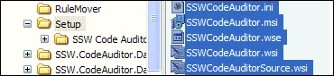

All setup files should stored under setup folder of your project root directory.   
<!--endintro-->

::: good  
  
:::

| We have a program called [SSW Code Auditor](http://www.ssw.com.au/ssw/CodeAuditor/Default.aspx) to check for this rule.  |
| --- |
