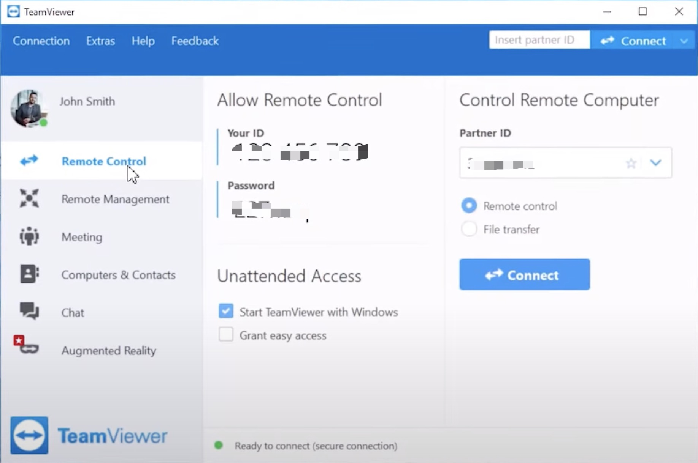

The corner stone of good user interface design is that if your users need instructions, you haven't done a good job. Of course with particularly complex applications there will be exceptions to this rule, but all developers should aim to make your interface as self-evident as possible.

<!--endintro-->

- There are no surprises
- There is no need to use help
- No excuse for RTFM (read the freaking manual)

A good UI is:

- Intuitive
- Feels fast e.g. no white screen, threading code
- Consistent
- Minimal popups
- No clutter - not busy
- Good error handling
- Easy to customize + apps (aka a platform)
- Gamification e.g. badges

**Suggested reading:**

- [The Design of Everyday Things: Revised and Expanded Edition (Nov 2013)](https://www.amazon.com/Design-Everyday-Things-Revised-Expanded/dp/0465050654)
- [Don’t Make Me Think, Revisited (3rd Edition)](https://www.amazon.com/Dont-Make-Think-Revisited-Usability/dp/0321965515)

::: good

:::

::: good

:::
