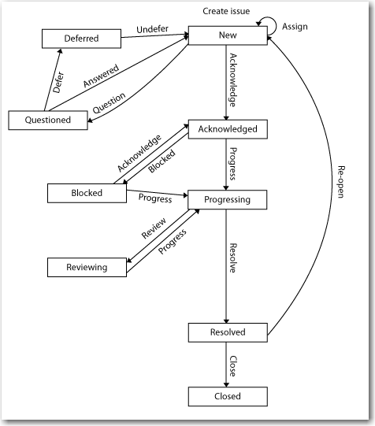

The workflow controls how an issue is taken from creation to closure via a Done or Not Done governing who does what at what point.  The workflow has several states in which a given number of transitions (actions within a state) can be taken by different people according to their role.   
<!--endintro-->

Here is a description of the main states of the SSW workflow:

1. New - When a new issue on your dashboard, it is either completley new, just assigned to you, just re-opened, just answered or just brought out of Deferred. Whatever the reason you should immediately either:
    * Assign it to somebody else ; this leaves it in New
    * Question - asks the Reporter a question about the issue which puts it in Questioned state
    * Update - this allows you yo set fields such as Priority, Due Date etc. without changing the status
    * Acknowledge - this puts it in Acknowledged State and means that you know about it and will do it as specified. If you can't make a due date set or an estimate has been made that is unrealistic; you should Question the reporter.
    * Progress - this puts it in the state of progressing and means that you are working on it and it will be completed as requested (due date/release number/time estimate)
    * Block - puts it in Blocked state awaiting some other event
    * Resolve Issue - this means that you have completed the task including checking in any code etc.
2. The normal workflow is New, Acknowledged, Progressing, Resolved, Closed.
3. An issue can be Questioned from New, Acknowledged or Progressing states; on Answer it returns to New
4. An issue can also be Blocked from New, Acknowledged or Progressing states. It can be brought off Blocked by either Acknowledge, Progress or Resolve
5. An issue can be Deferred only by the Reporter from Acknowledged or Questioned states; if the Assignee wants it Deferred, they should ask the Reporter via a Question.
6. From Resolved state, the Reporter then closes the issue if satisfied with the outcome; otherwise it can be reopened. If it is a Development issue; the Reporter should test Defects on Local Staging and new development in ClientDev. Other issues are closed according to whether the reporter is satisfied with the resolution.

The following digram shows the main flows:

(A table further defining the workflow this will appear here in due course)
