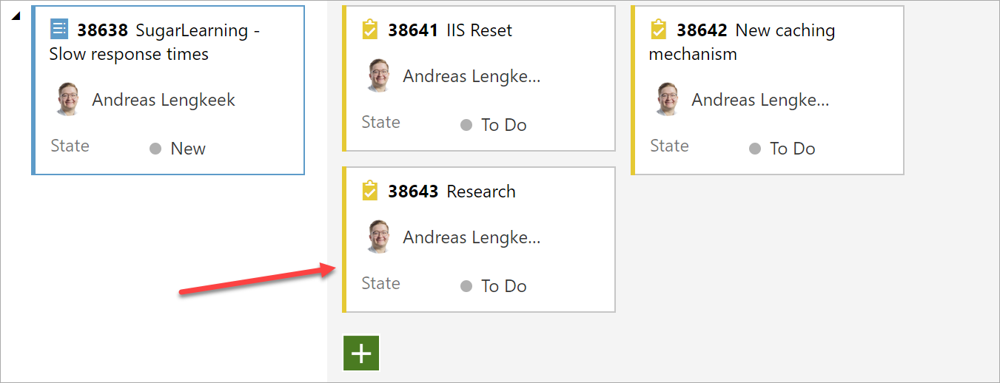
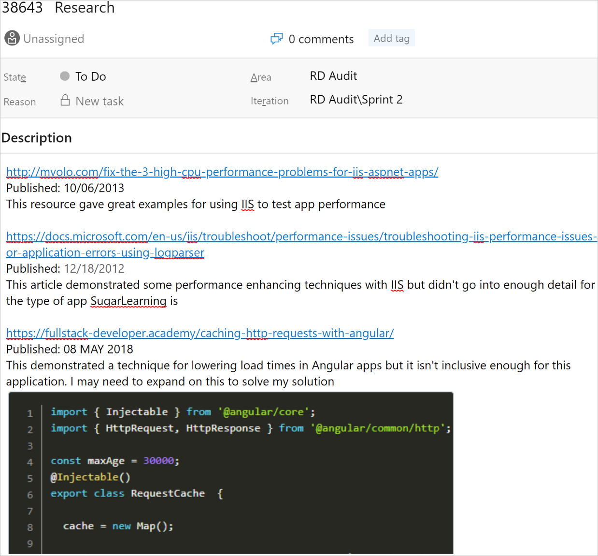
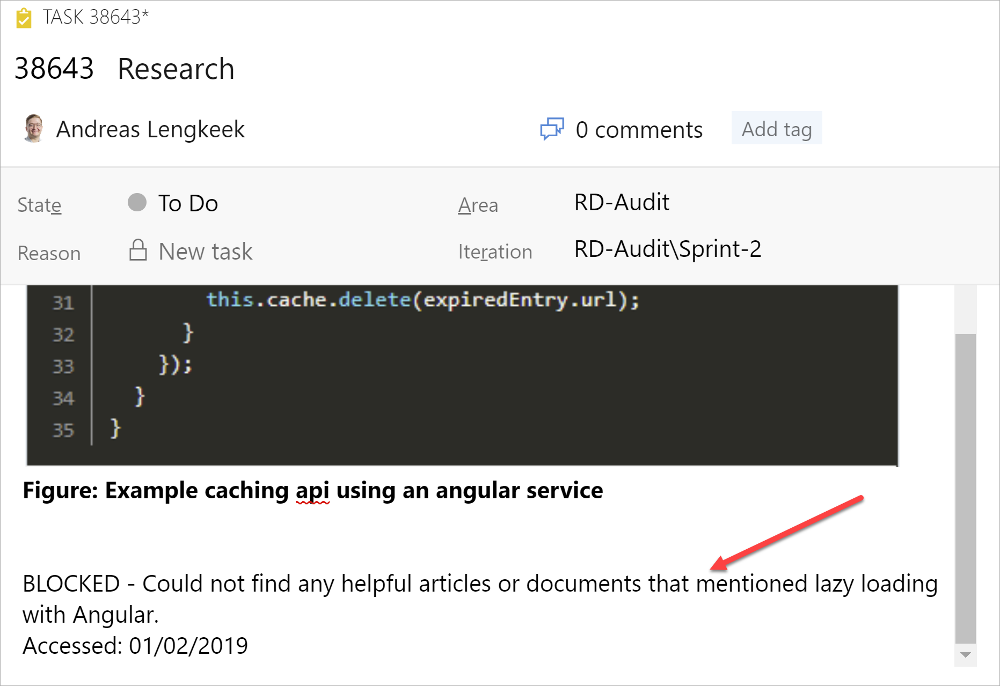

If you have done significant research on a topic, this should be documented.

Create a new task under the PBI and place these resources in the description with a short summary of what you got from this link.

::: good
Good Example: Task for research created under the PBI

:::

<!--endintro-->

Each source you have used should be referenced here with the publish date and a short description of what you got from the content. If you take screen shots of the relevant sections then that is even better.

::: good
Good Example: Example research task on using caching to improve load times with SugarLearning

:::

::: good
Good Example: If you don't find any suitable answers to your query, remember to make a short note of what you were looking for

:::
