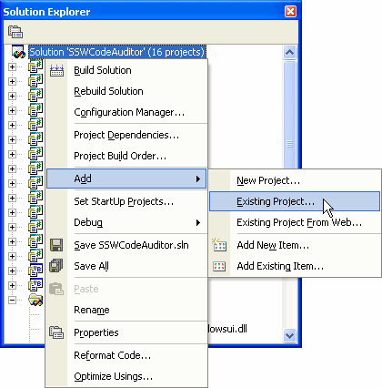
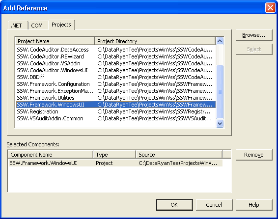

When you obtain a 3rd party .dll (in-house or external), you sometimes get the code too. So should you:

* reference the Project (aka including the source) or
* reference the assembly?

<!--endintro-->

When you face a bug, there are 2 types of emails you can send:

1. Dan, I get this error calling your Registration.dll? or
2. Dan, I get this error calling your Registration.dll and I have investigated it. As per our conversation, I have changed this xxx to this xxx.

The 2nd option is preferable.
**The simple rule is:**
* If there are no bugs then reference the assembly, and
* If there are bugs in the project (or any project it references [See note below]) then reference the project.

Since most applications have bugs, therefore most of the time you should be using the second option.

If it is a well tested component and it is not changing constantly, then use the first option.

1. Add the project to solution (if it is not in the solution).  Figure: Add existing project
2. Select the "References" folder of the project you want to add references to, right click and select "Add Reference...". 
 Figure: Add reference
3. Select the projects to add as references and click OK.  Figure: Select the projects to add as references

Note: We have run into a situation where we reference a stable project A, and an unstable project B. Project A references project B. Each time project B is built, project A needs to be rebuilt.

Now, if we reference stable project A by dll, and unstable project B by project according to this standard, then we might face referencing issues, where Project A will look for another version of Project B ?the one it is built to, rather than the current build, which will cause Project A to fail.

To overcome this issue, we then reference by project rather than by assembly, even though Project A is a stable project. This will mitigate any referencing errors.
