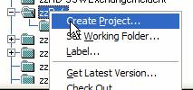
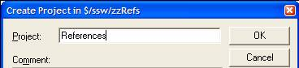
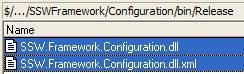
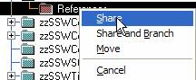
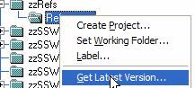
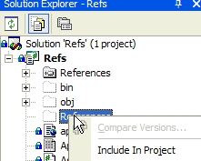
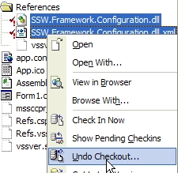

If we lived in a happy world with no bugs, I would be recommending this approach of using shared components from source safe. As per the prior rule, you can see we like to reference "most" .dlls by project.
However if you do choose to reference a .dll without the source, then the important thing is that if the .dll gets updated by another developer, then there is **\*nothing\*** to do for all other developers ?they get the last version when they do your next build. Therefore you need to follow this:

<!--endintro-->

As the component user, there are six steps, but you only need to do them once:

1.  First, we need to get the folder and add it to our project, so in SourceSafe, right click your project and create a subfolder using the Create Project (yes, it is very silly name) menu. **Figure: Create 'folder' in Visual Source Safe** Name it References
    **Figure: 'References' folder**
2.  Share the dll from the directory, so if I want SSW.Framework.Configuration, I go to $/ssw/SSWFramework/Configuration/bin/Release/

    I select both the dll and the dll.xml files, right-click and drag them into my $/ssw/zzRefs/References/ folder that I just created in step 1. **Figure: Select the dlls that I want to use** **Figure: Right drag, and select "Share"**

3.  Still in SourceSafe, select the References folder, run get latest?to copy the latest version onto your working directory.
    **Figure: Get Latest from Visual Source Safe** VSS may ask you if you want to create the folder, if it doesnt exist. Yes, we do.
4.  Back in VS.NET, select the project and click the show-all files button in the solution explorer, include the References folder into the project (or get-latest if its already there)
    **Figure: Include the files into the current project**
5.  IMPORTANT! If the files are checked-out to you when you include them into your project, you MUST un-do checkout immediately.

        You should never check in these files, they are for get-latest only.

    **Figure: Undo Checkout, when VS.NET checked them out for you...**

6.  Add Reference?in VS.NET, browse to the References?subfolder and use the dll there.
7.  IMPORTANT! You need to keep your 'References' folder, and not check the files directly into your bin directory. Otherwise when you 'get latest', you won't be able to get the latest shared component.

All done. In the future, whenever you do get-latest?on the project, the any updated dlls should come down and be linked the next time you compile. Also, if anyone checks out your project from Source Safe, they will have the project linked and ready to go.
