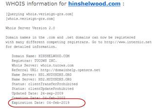

If you own a domain and want Google to instantly recognize it as a permanent domain then register the maximum (10 years for .com depending on the domain provider) you can in one go. Google will assume it is permanent and rate you higher sooner.

<!--endintro-->
<dl class="goodImage">&lt;dt&gt;&lt;/dt&gt;<dd>Figure: Good example - Domain registered for 10 years</dd></dl>
