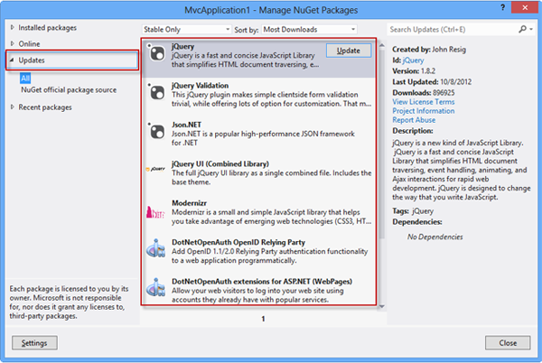

ASP.NET MVC makes good use of NuGet for managing its dependencies, however these dependencies can easily get out of date.

 <excerpt class='endintro'></excerpt> 

When you begin a new MVC project, there are often many dependencies that already have updated versions.

You should immediately update your NuGet dependencies in the NuGet Package Manager after starting an MVC project. You should also frequently check for new updates during development so you’re not working with out of date versions. 

 Figure: Even after starting a brand new project, NuGet shows a lot of required updates! 

