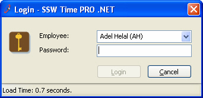

The user's last settings should be saved and should be selected as the Default the                     next time a form is opened in many instances. For example:

<!--endintro-->

* Login forms - the last login name should be the Default selected and the cursor should be in the password box.        <dl class="badImage">&lt;dt&gt; 
            
         &lt;/dt&gt;<dd> Figure: Bad Example - Last Username is not saved</dd></dl><dl class="goodImage">&lt;dt&gt; 
            
         &lt;/dt&gt;<dd> Figure: Good Example - Last Username is saved</dd></dl>
* Report criteria forms - e.g. date start and date end fields should be automatically populated

How do I store the settings?

* .NET: Use the        [Configuration Block](/do-you-use-configuration-management-application-block) to store the settings.
* Access: Use a local table called 'Control' with one record.
