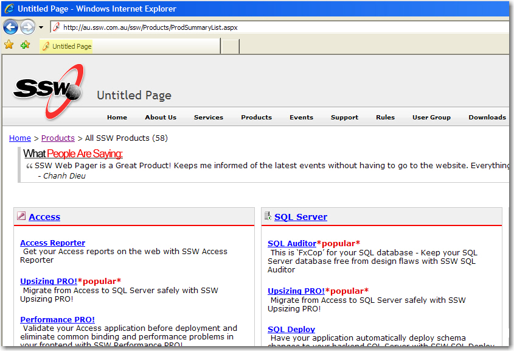
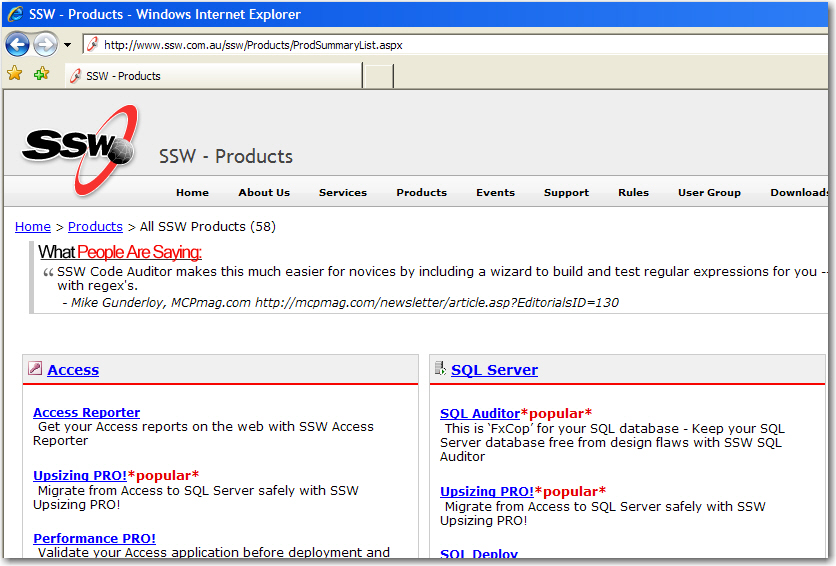

Your site visitors should never see <strong>Untitled Page</strong> on 
   their browser. When creating a new page, remember to change the 
   default page title. This rule applies whether you are using a Master 
   Page or not.
                

 <excerpt class='endintro'></excerpt> 
<dl class="badImage"><dt> 
       
   </dt><dd>Figure: Bad example - A page with the default title </dd></dl><dl class="goodImage"><dt> 
       
   </dt><dd>Figure: Good example - A page with a good title </dd></dl>

