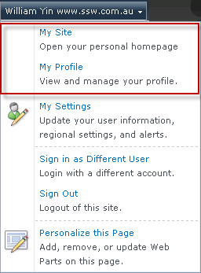
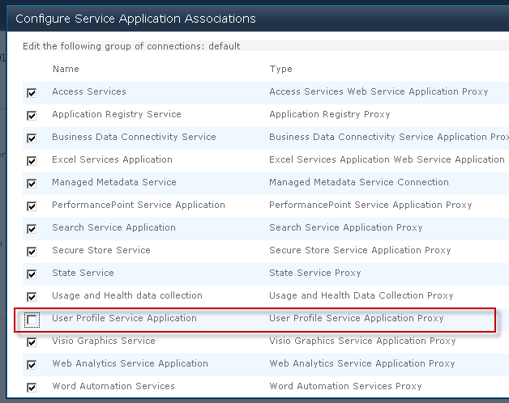
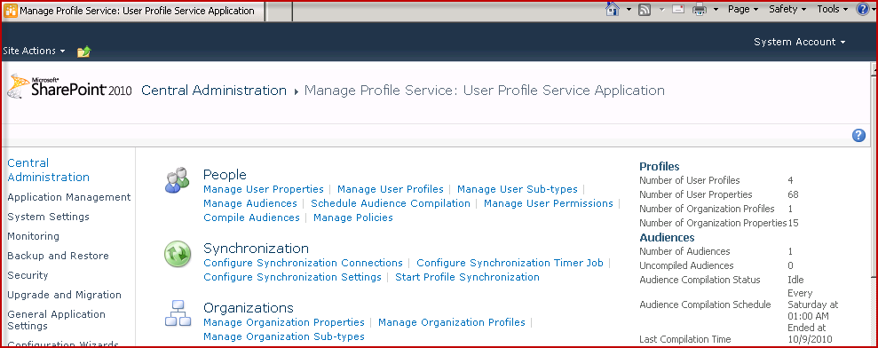
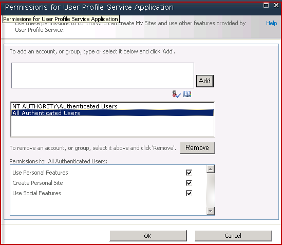
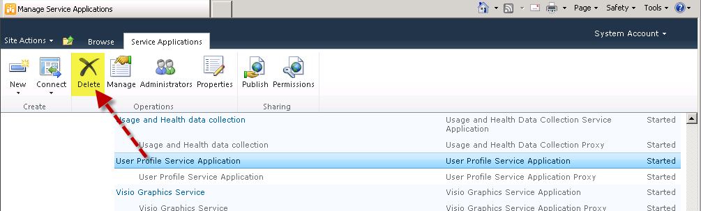

 <strong>My Site</strong> and  <strong>My Profile</strong> are great but if you are not using them, it makes sense to remove them: 
**Figure: Links need to be hidden** 

<!--endintro-->

You can follow below steps to hide “My Site” and “My Profile”, 
There are a few options, based on what you need to do: 

    <li> <strong>Delete the association</strong> (not recommended)
    <blockquote dir="ltr" style="margin-right:0px;">
    

    a. Go to  <strong>Central Admin</strong> |  <strong>Application Management</strong> |  <strong>Service Applications</strong> |  <strong>Configure service application associations</strong> ,  
    Choose “default” link:
     
     ::: bad Figure: Choose “default” link   ::: 

    

    b.Uncheck the “ <strong>User Profile Service Application</strong> ”  in the
    opened page, then click “ <strong>OK</strong> ”:
     
    
     ::: bad Figure: uncheck the association for user
    profile service   ::: 

    </blockquote>
    </li>
    <li> <strong>Customize permissions for only some people to have access to create personal site</strong> <blockquote dir="ltr" style="margin-right:0px;">
    

    You can remove it for most people - but leave it for only some users.
    

    

    a.   
    Go to  <strong>Central Admin</strong> |  <strong>Application Management</strong> |  <strong>Service Applications</strong> |  <strong>Manage service applications</strong> , 
    Click the link of “User Profile Service Application”, navigate to its manage
    page: <strong> 
    </strong>  ::: good Figure: “User Profile
    Service Application” manage page   ::: 

    

    b.    Click
     <strong>People</strong> |  <strong>Manage User Permissions</strong> , you can
    customize the user profile permission for specific users: <strong> </strong> Figure: Better - customize User profile
    permission

    

    </blockquote>
    </li>
    <li> <strong>Delete the service</strong> (recommended if you don't need the service at all in your farm)
    <blockquote dir="ltr" style="margin-right:0px;">
    

     <strong>Note</strong> : You can always create it later if you need it in the
    future. 
     
    Go to  <strong>Central Admin</strong> |  <strong>Application Management</strong> |
     <strong>Service Applications</strong> |  <strong>Manage service applications</strong> ,
    

    

    Select “User Profile Service Application”, then click the
    “Delete” button on the ribbon: <strong> 
    </strong> <strong> <strong>Figure: Best - delete user profile
    service</strong> </strong> 

    </blockquote>
    </li>
    
        
             <strong>Note</strong> :
    Later on if you want to get My Site working read these 2 links… unless Microsoft
    creates a services that fixes User Profile Synchronization service…. thanks to
    Mark Rhodes for these tips… 
    <a href="http://www.harbar.net/articles/sp2010ups2.aspx">
    http://www.harbar.net/articles/sp2010ups2.aspx</a>
    and <a href="http://www.harbar.net/articles/sp2010ups.aspx">
    http://www.harbar.net/articles/sp2010ups.aspx </a>

[ 
    ](http://www.harbar.net/articles/sp2010ups.aspx)
