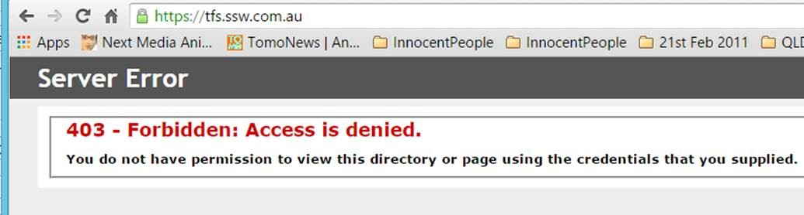
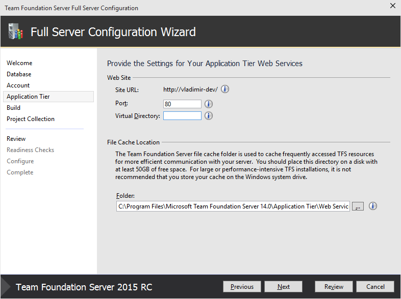

Many clients that complain when they type: <b>tfs.northwind.com </b> ...and then see ‘Server Error 403 – Forbidden: Access is denied’​

It is not a nice experience that in 2015 the out-of-the-box requirement is still to type "/tfs".

 <excerpt class='endintro'></excerpt> 
<dl class="badImage"><dt>​</dt><dd>Figure: Bad example - A horrible first experience... did I get the URL wrong? Is the server down?​</dd></dl>
 
   <strong>Note: </strong>The better out-of-the-box experience for Exchange OWA is to type <a href="https://mail.ssw.com.au/" target="_blank">https://mail.ssw.com.au/</a> ...and it redirects to 
    
   <a href="https://mail.ssw.com.au/owa/auth/logon.aspx?replaceCurrent=1&url=https://mail.ssw.com.au/owa/" target="_blank">https://mail.ssw.com.au/owa/auth/logon.aspx?replaceCurrent=1&url=https%3a%2f%2fmail.ssw.com.au%2fowa%2f</a>.

So fix the nasty out-of-the-box experience.​ 
<dl class="image"><dt>
      
   </dt><dd>Figure: Option 1 – This is one way. Include some text to tell devs that they can remove the need for /tfs - on the Application Tier page specify port 80 and an empty Virtual Directory</dd></dl><dl class="image"><dt>
      
   </dt><dd>Figure: Option 2 – This is another way. In IIS add the redirect to remove the need to type “/tfs” 
      (recommended)​​</dd></dl>

