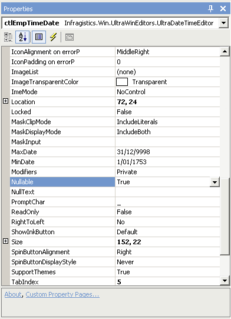

A good replacement for the standard Date Time picker is the UltraDatePicker by Infragistics.

The main reason for the use of the UltraDatePicker over the standard .NET one is because the .NET one does not take null for a date value.

<!--endintro-->

This is a lot of hassle for DataBinding. The Windows Form DataBinding will try to put null into the bound field, when:

1. The bound data is DBNull

2. The current row is removed (i.e., there is no more data in the DataTable)

If you set the property "Nullable" to false in UltraDatePicker, the same issues appears again.

So the solution is to allow null, but where the field is required, make sure the validation picks it up and asks the user to enter a value when saving the form.
