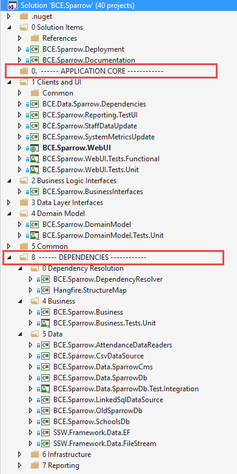

The name of your solution and the names of the projects in your solution should be consistent.

Read the rule: [Do you have a consistent .NET solution structure?](/do-you-have-a-consistent-net-solution-structure)

<!--endintro-->

::: good  
  
:::
