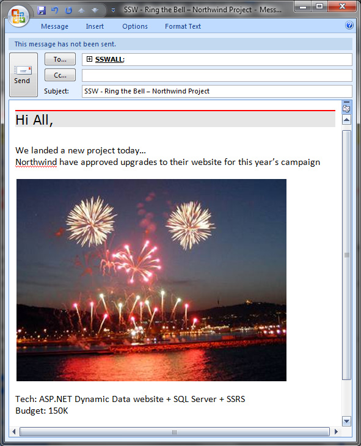

A great way of motivating your staff is to have some form of recognition in place; happy employees are good employees! One of the simplest ways to achieve this is by having a bell located within the office for employees to ring when they have made a large sale, secured a big deal or some important news to announce. By showing appreciation to your employees you encourage all your staff to perform.

<!--endintro-->

At SSW whenever a big new project is signed up, we sell an enterprise license for one of our products, or we release a project into production we send an email to all staff and then ring the bell, which is located in the middle of the office.

::: info
**Management Tip**: As a company owner or manager, you might want to see who of your employees are contributing to this feeling of appreciation around the office, and you can do that by querying your **Mail Server** for threads with "Ring the Bell" in the subject.
:::

::: info
**Note:** For really large milestones, you may want to go a step further and organise a [reward for the team](/reward-your-developers).
:::
