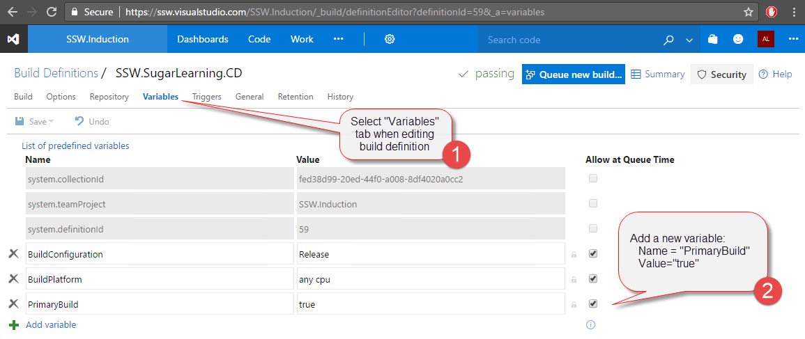

The real value of the code health system is that is made improvements in code quality more visible to the team and managers. By including several steps to the build process, the results of the analysers included in previous steps can be extracted out and summarised in a report spanning the project's lifetime. 

<!--endintro-->

### Related Steps to Code Health:

* [Do you use the Code Health Extensions in VS Code?](/_layouts/15/FIXUPREDIRECT.ASPX?WebId=3dfc0e07-e23a-4cbb-aac2-e778b71166a2&TermSetId=07da3ddf-0924-4cd2-a6d4-a4809ae20160&TermId=1e14fbd6-0c72-4791-9c79-893de1fdd89e)
* [Do you use the Code Health Extensions in Visual Studio?](/_layouts/15/FIXUPREDIRECT.ASPX?WebId=3dfc0e07-e23a-4cbb-aac2-e778b71166a2&TermSetId=07da3ddf-0924-4cd2-a6d4-a4809ae20160&TermId=9e155c90-0502-447a-a1a3-fb2b1580982a)

### What Steps to Include in the Build Definition

Summary:

1. Ensure "Restore NuGet Packages" & "Build Solution" are in the build definition to run the Roslyn analysers.
2. Add several npm and command line steps to the build definition to run tslint. (On premises builds require an additional step).
3. Include an identifying variable "PrimaryBuild" to the build definition.
4. Check the build is running without issues.

The resulting build should look like this.
<dl class="ssw15-rteElement-ImageArea"></dl>

::: good
Figure: Good Example - Build Passing with no summary issues

:::

<dl class="ssw15-rteElement-ImageArea"> <mark>Ensure utilisation of TeamBuild2015 or higher. (No support for XAML builds)</mark> Edit the build definition on <companyname>.visualstudio.com, and add the following build tasks. If your project does not contain TypeScript files, then you do not need to include the TSLint build tasks. </companyname></dl><dl class="ssw15-rteElement-ImageArea"></dl>

::: good
Figure: Good Example - Steps added to build definition.

:::

<dl class="ssw15-rteElement-ImageArea"></dl> **Figure: Example directory for TSLint run commands
** 
Under advanced for the Command Line tasks, the Working Directory can be specified if necessary.

TsLint
 **Npm** - Install tslint and typescript
 **Name:** npm install tslint
 **Working Folder:** <top directory=""></top>
 **Npm Command:** install
 **Arguments:** -g tslint typescript

 **Command Line** - Check the version (Useful to determine rule discrepancies across builds)
 **Name:** Check tslint version
 **Tool:** tslint
 **Arguments:** -v

 **Command Line** - Builds a default configuration file for the build (Without it issues can differ between build and development environment
 **Name:** Create tslint config file
 **Tool:** tslint
 **Arguments:** --init

 **Command Line** - Run tslint, force is required to stop the build from crashing (TSLint will return and exit code of 1 regardless of if issues exist)
 **Name:** Run tslint
 **Tool:** TSLint
 **Arguments:** --force <solution directory="">/**/*.ts{,x}</solution>

If your build is being hosted, then the config file must be reloaded every time. <mark>If your build is running on premises</mark>, the config file will attempt to load over the existing one and break the build.
If this is the case, just add a step to delete your config file after the scan is complete.
<dl class="ssw15-rteElement-ImageArea">Figure: Command line step to remove the config file (tslint.json) after the linter has run </dl>
**Command Line** - Remove the tslint config file, as it will break future scan if the build is on premises if a config file already exists and an attempt to add another one is made.
 **Name:** Remove tslint config
 **Tool:** del
 **Arguments:** tslint.json

Once complete, save the build definition and run the build.
Then check the build is successful.
If the build fails (due to errors), these should be corrected in the development environment.

### Include "PrimaryBuild" variable

For the purposes of reporting, a unique tag must be added to the build definition which the Code Health steps have been applied to. 
This is done with the <mark>addition of a variable (Name = PrimaryBuild, Value = true)</mark>
<dl class="ssw15-rteElement-ImageArea"></dl> **Figure: Steps to add PrimaryBuild variable to build definition
** 
### Check the build is running without issues

<dl class="ssw15-rteElement-ImageArea"></dl>

::: bad
Figure: Bad Code with a Good Code Health Implementation - Build broke due to compile errors. Must fix to proceed.
:::

<dl class="ssw15-rteElement-ImageArea"></dl>

::: bad
Figure: Bad Code with a Good Code Health Implementation - Successful build with warnings. These should be reprioritised as errors, or removed

:::

<dl class="ssw15-rteElement-ImageArea"></dl>

::: good
Figure:  Good Code with a Good Code Health Implementation - Successful build with no warnings.

:::
