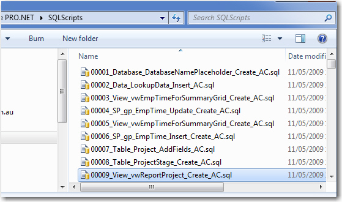

Every time a change is made to your product's SQL Server Database, script out the change. 
Nowadays if you are using frameworks such as EF Core, this will most likely be handled for you with migrations. For older applications, you can use SQL Management Studio or Visual Studios, but every time you make changes you must save the change as a .sql script file so any alterations are scripted. 

Everything you do on your database will be done at least three times ([once on development, once for testing and once on production](/do-you-have-separate-development-testing-and-production-environments)). Change control is one of the most important processes to ensuring a stable database system. 

Let's see how its done. 

<!--endintro-->

## Modern Frameworks (EF)
**(TODO: Add an Image of Migrations)**

Every change you do to the schema must be either saved in code or scripted out. We recommend using Migrations feature of Entity Framework. It allows you to keep track of all the changes in the similar fashion as SQL Deploy. 

Watch video: [How to Use Code First with Entity Framework - Brendan Richards](http://tv.ssw.com/4902/use-code-first-entity-framework-brendan-richards) to learn more. 

## Legacy 

Keep the scripts in a separate directory, this is often named `SQLScripts`. This folder should only contain .sql files. 

1. When you have an error you can see exactly which script introduced it
2. You don't have to use a compare tool like Red-Gate SQL Compare at the end of your development cycle
3. Your application can automatically make schema changes
4. The application can have a "Create" database button when installed for the first time
5. The application can have an "Upgrade" button and work out itself if this new version needs scripts to be run
6. The application can tell if it is an old version (as a newer version may have upgraded the schema), so you only use the latest clients
7. The application can have a "Reconcile" feature that compares the current schema to what it should be

### File naming convention:

The script file naming convention should be as follows: 

XXXXX_ObjectType_ObjectName_ColumnName_Description_SchemaMasterInitials.sql  

eg.  00089_Table_OrderStatus_Status_ChangeFromBitToChar_AC.sql 

  