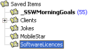

There are many types of emails which you receive but will never actually reply to. For example, a client may email "Sounds great - please go ahead." These kinds of emails should be kept as a reference for the future.  

<!--endintro-->

Emails that came into your mailbox should not be left in your Inbox. The aim is to read, action (if needed) and delete. You should be trying to get your Inbox down to 0 items.

So what's left in your 'Inbox' should only be 'To Do' items. Sure you might want to add subfolders to group related projects etc. but these subfolders should also contain items 'To Do'. Some people leave emails in their Inbox, for later reference only. We believe this is not a good idea, and you should create 2 folders outside your Inbox called 'Saved Items' and 'Saved Personal Items' for such emails.

[[goodExample]]
| 
Microsoft Outlook provides you with 4 main folders: 'Draft', 'Inbox', 'Outbox' and 'Send Items'. But we believe they are missing 2 additional folders: 'Saved Items' and 'Saved Personal Items'. You can use these two folders to keep your work-related or personal emails that you wanted to keep.

You can create these two folders next to the Inbox and move the emails there.
